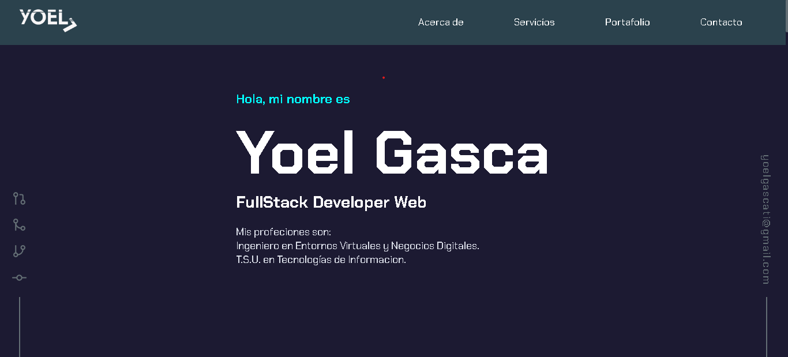
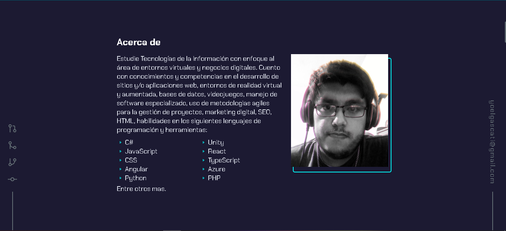
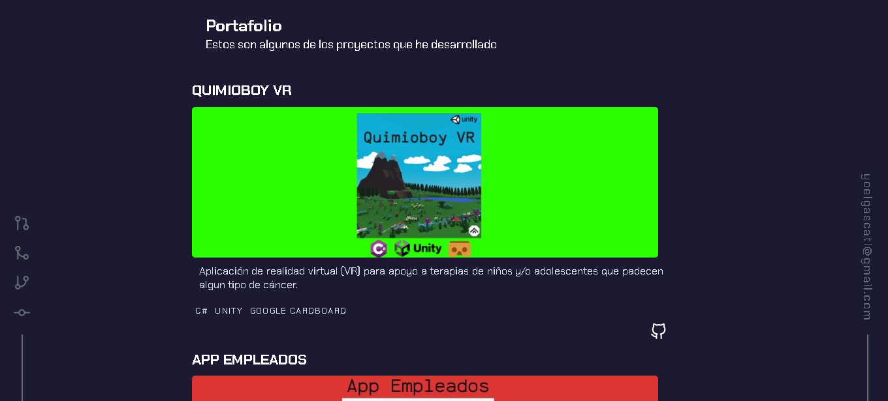
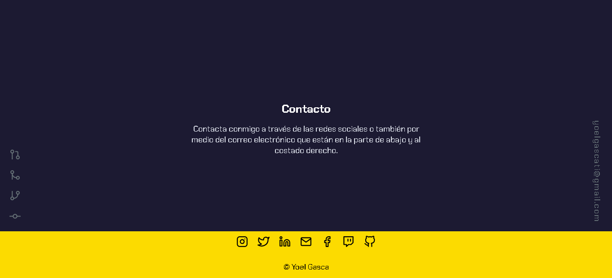

# Practica tu HTML: crea una maqueta de blog

## Instrucciones

Imagina que está diseñando o rediseñando su sitio web personal. Cree mockup del mismo y luego el HTML que usaría para construir los diversos elementos que componen al mismo. Puede hacer esto en papel y escanearlo, o usar el software de su elección, solo asegúrese de codificar manualmente todo el HTML.

## Rúbrica

| Criterios | Ejemplar | Adecuado | Necesita mejorar |
| -------- | --------------------------------------- | ------------------------ | ------------------------------ |
| | El diseño de un blog se representa visualmente con al menos 10 elementos de marcado mostrados | Un diseño de blog se representa visualmente con alrededor de 5 elementos de marcado mostrados | El diseño de un blog se representa visualmente con un máximo de 3 elementos de marcado mostrados |

### Maquetado del sitio
Por el momento a este proyecto se pretende que tenga tres o cuatro secciones donde se colocara distinta informacion sobre un servidor.

#### Estos podrian ser algunas de las imagenes para estas secciones

<strong>Presentación</strong>

<br/>

En esta imagen se puede observar la sección que será dedicada a una pequeña descripción con el nombre, la ocupación y los grados o títulos académicos que he obtenido.

<strong>Acerca de</strong>

<br/>

También se agregaría la sección de acerca de para que los usuarios conozcan mas informacion y puedan ver algunas habilidades 

<strong>Proyectos</strong>

<br/>

En esta seccion se podran ver algunos de los  proyectos destacados que se han desarrollado.

<strong>Contacto</strong>

<br/>

Aquí encontraran las redes sociales e E-mail como formas de contactar con un servidor.

Aqui esta la codificación manualmente de todo el HTML.

```HTML
<!DOCTYPE html>
<html lang="en">
<head>
    <meta charset="UTF-8">
    <meta http-equiv="X-UA-Compatible" content="IE=edge">
    <meta 
        name="description"
        content="Freelancer, IT Services, Sitios Web, SEO, Apps, Social Media, Digital Platforms, Desarrollo, Gestión, Redes Sociales, Plataformas digitales, Contenidos digitales, Digital content, Programacion, Programing">
    <meta name="viewport" content="width=device-width, initial-scale=1.0">
    <title>Yoel Gasca</title>
    <link rel="icon" type="image/png" href="./Img/Ico-Yoel.png">
    <link rel="stylesheet" href="CSS/styles.css">
    <link rel="stylesheet" href="CSS/media-querys.css">
    <script src="https://unpkg.com/scrollreveal"></script>
</head>
<body>
    <div class="app">
        <div class="lateral iqz">
            <ul>
                <li>
                    <svg xmlns="http://www.w3.org/2000/svg" width="24" height="24" viewBox="0 0 24 24" fill="none" stroke="currentColor" stroke-width="2" stroke-linecap="round" stroke-linejoin="round" class="feather feather-git-pull-request"><circle cx="18" cy="18" r="3"/><circle cx="6" cy="6" r="3"/><path d="M13 6h3a2 2 0 0 1 2 2v7"/><line x1="6" y1="9" x2="6" y2="21"/></svg>
                </li>
                <li>
                    <svg xmlns="http://www.w3.org/2000/svg" width="24" height="24" viewBox="0 0 24 24" fill="none" stroke="currentColor" stroke-width="2" stroke-linecap="round" stroke-linejoin="round" class="feather feather-git-merge"><circle cx="18" cy="18" r="3"/><circle cx="6" cy="6" r="3"/><path d="M6 21V9a9 9 0 0 0 9 9"/></svg>
                </li>
                <li>
                    <svg xmlns="http://www.w3.org/2000/svg" width="24" height="24" viewBox="0 0 24 24" fill="none" stroke="currentColor" stroke-width="2" stroke-linecap="round" stroke-linejoin="round" class="feather feather-git-branch"><line x1="6" y1="3" x2="6" y2="15"/><circle cx="18" cy="6" r="3"/><circle cx="6" cy="18" r="3"/><path d="M18 9a9 9 0 0 1-9 9"/></svg>
                </li>
                <li>
                    <svg xmlns="http://www.w3.org/2000/svg" width="24" height="24" viewBox="0 0 24 24" fill="none" stroke="currentColor" stroke-width="2" stroke-linecap="round" stroke-linejoin="round" class="feather feather-git-commit"><circle cx="12" cy="12" r="4"/><line x1="1.05" y1="12" x2="7" y2="12"/><line x1="17.01" y1="12" x2="22.96" y2="12"/></svg>
                </li>
            </ul>
        </div>
        <div class="lateral der">
            <a class="email" href="yoelgascati@gmail.com">
                yoelgascati@gmail.com
            </a>
        </div>
        <header class="header">
            <div class="container_logo">
                <a href="index.html"></a>
            </div>
            <div class="container-nav">
                <nav class="menu">
                    <ul>
                        <li>
                            <a href="#acercaDe" class="item_menu">Acerca de</a>
                        </li>
                        <li>
                            <a href="#servicios" class="item_menu">Servicios</a>
                        </li>
                        <li>
                            <a href="#portafolio" class="item_menu">Portafolio</a>
                        </li>
                        <li>
                            <a href="#contacto" class="item_menu">Contacto</a>
                        </li>
                        <!--<li>
                            <a href="" class="button_cv">Ver CV</a>
                        </li>-->
                    </ul>
                </nav>
            </div>
            <div class="menu_responsive">
                <button class="button_menu">
                    <svg xmlns="http://www.w3.org/2000/svg" width="24" height="24" viewBox="0 0 24 24" fill="none" stroke="currentColor" stroke-width="2" stroke-linecap="round" stroke-linejoin="round" class="feather feather-menu"><line x1="3" y1="12" x2="21" y2="12"/><line x1="3" y1="6" x2="21" y2="6"/><line x1="3" y1="18" x2="21" y2="18"/></svg>
                </button>
            </div>
        </header>
        <main id="main">
            <section class="container_section" id="presentation">
                <!--Presentacion-->
                <div class="container_info">
                    <div class="greeting_profile">
                        <p>
                            Hola, mi nombre es
                        </p>
                    </div>
                    <div class="name_profile">
                        <h1>
                            Yoel Gasca
                        </h1>
                        <h2>FullStack Developer Web</h2>
                    </div>
                    <div class="descripcion_pers">
                        <p>
                            Mis profeciones son:<br>
                            Ingeniero en Entornos Virtuales y Negocios Digitales.<br>
                            T.S.U. en Tecnologías de Informacion.
                        </p>
                    </div>               
                </div>
            </section>
            <!--Acerca de-->
            <section class="container_section" id="acercaDe">
                <div class="container_info">
                    <div class="container_title_section">
                        <h2 class="text-title-section">
                            Acerca de
                        </h2>
                    </div>
                    <div class="container_description_section">
                        <div class="text_section">
                            <p>
                                Estudie Tecnologías de la Información con enfoque al área de entornos virtuales y negocios digitales. Cuento con conocimientos y competencias en el desarrollo de sitios y/o aplicaciones web, entornos de realidad virtual y aumentada, bases de datos, videojuegos, manejo de software especializado, uso de metodologias agiles para la gestión de proyectos, marketing digital, SEO, HTML, habilidades en los siguientes lenguajes de programación y herramientas:
                            </p>
                            <ul class="languajes">
                                <li>
                                    <a href="https://learn.microsoft.com/es-es/dotnet/csharp/">C#</a>
                                </li>
                                <li>
                                    <a href="https://unity.com/es">Unity</a>
                                </li>
                                <li>
                                    <a href="https://developer.mozilla.org/es/docs/Web/JavaScript">JavaScript</a>
                                </li>
                                <li>
                                    <a href="https://es.reactjs.org/">React</a>
                                </li>
                                <li>
                                    <a href="https://www.w3schools.com/css/">CSS</a>
                                </li>
                                <li>
                                    <a href="https://www.typescriptlang.org/">TypeScript</a>
                                </li>
                                <li>
                                    <a href="https://angular.io/">Angular</a>
                                </li>
                                <li>
                                    <a href="https://azure.microsoft.com/en-in/">Azure</a>
                                </li>
                                <li>
                                    <a href="https://www.python.org/">Python</a>
                                </li>
                                <li>
                                    <a href="https://www.php.net/">PHP</a>
                                </li>
                            </ul>
                            <p>Entre otros mas.</p>
                        </div>
                        <div class="container-img-profile">
                            <div class="img_effect">
                                
                            </div>
                        </div>
                    </div>
                </div>
            </section>
            <!--Servicios-->
            <section class="container_section" id="servicios">
                <div class="container_info">
                    <div class="container_title_section">
                        <h2 class="text-title-section">
                            Servicios
                        </h2>
                    </div>
                    <div class="container_description_section">
                        <div class="text_services">
                            <p>
                                Ofrezco servicios de soluciones de IT (Tecnologías de la Informacion) como:
                            </p><br>
                            <ul class="Services-List">
                                <li>
                                    <p>Desarrollo de sitios web, posicionamiento S.E.O., aplicaciones web, entornos de AR y VR</p>
                                    
                                </li><br>
                                <li>
                                    <p>Gestión de plataformas digitales y/o redes sociales</p>
                                    
                                </li><br>
                                <li>
                                    <p>Creación y desarrollo de contenidos digitales, así como también edición de videos</p>
                                    
                                </li><br>
                                <li>
                                    <p>Mantenimiento de equipos de cómputo</p>
                                    <br>
                                </li><br>
                            </ul>
                        </div>
                        <p>Para mas detalles puedes consultar el catálogo completo de todos los servicios en mis redes sociales que están en la sección de contacto.</p>
                    </div>
                </div>
            </section>
            <!--Proyectos-->
            <section class="container_section" id="portafolio">
                <div class="container_info">
                    <div class="container_title_section">
                        <h2 class="text-title-section">
                            Portafolio
                        </h2>
                        <p>Estos son algunos de los proyectos que he desarrollado</p> <br/>
                    </div>
                    <div class="container_proyects">
                        <div class="description_proyect">
                            <p class="text_proyect">
                            </p>
                            <h3 class="name_proyect">
                                Quimioboy VR
                            </h3>
                            <div class="container_cards">
                                <a href="https://github.com/Yoel-Gasca/Forest_VR">
                                    <div class="img_proyect1">
                                        
                                    </div>
                                </a>
                            </div>
                            <div class="info_proyect">
                                <p>
                                    Aplicación de realidad virtual (VR) para apoyo a terapias de niños y/o adolescentes que padecen algun tipo de cáncer.
                                </p>
                            </div>
                            <div class="programing_languages">
                                <ul>
                                    <li>
                                        C#
                                    </li>
                                    <li>
                                        Unity
                                    </li>
                                    <li>
                                        Google CardBoard
                                    </li>
                                </ul>
                            </div>
                            <div class="links_proyect">
                                <ul>
                                    <li>
                                        <a href="https://github.com/Yoel-Gasca/Forest_VR">
                                            <svg xmlns="http://www.w3.org/2000/svg" width="24" height="24" viewBox="0 0 24 24" fill="none" stroke="currentColor" stroke-width="2" stroke-linecap="round" stroke-linejoin="round" class="feather feather-github"><path d="M9 19c-5 1.5-5-2.5-7-3m14 6v-3.87a3.37 3.37 0 0 0-.94-2.61c3.14-.35 6.44-1.54 6.44-7A5.44 5.44 0 0 0 20 4.77 5.07 5.07 0 0 0 19.91 1S18.73.65 16 2.48a13.38 13.38 0 0 0-7 0C6.27.65 5.09 1 5.09 1A5.07 5.07 0 0 0 5 4.77a5.44 5.44 0 0 0-1.5 3.78c0 5.42 3.3 6.61 6.44 7A3.37 3.37 0 0 0 9 18.13V22"/></svg>
                                        </a>
                                    </li>
                                </ul>
                            </div>
                        </div>
                    </div>
                    <div class="description_proyect">
                        <p class="text_proyect">
                        </p>
                        <h3 class="name_proyect">
                            App Empleados
                        </h3>
                        <div class="container_cards">
                            <a href="https://github.com/Yoel-Gasca/appempleados">
                                <div class="img_proyect1">
                                    
                                </div>
                            </a>
                        </div>
                        <div class="info_proyect">
                            <p>
                                Aplicación web para registrar automáticamente los datos de un padrón de empleados en una base de datos.
                            </p>
                        </div>
                        <div class="programing_languages">
                            <ul>
                                <li>
                                    Angular
                                </li>
                                <li>
                                    TypeScript
                                </li>
                                <li>
                                    FireBase
                                </li>
                            </ul>
                        </div>
                        <div class="links_proyect">
                            <ul>
                                <li>
                                    <a href="https://github.com/Yoel-Gasca/appempleados">
                                        <svg xmlns="http://www.w3.org/2000/svg" width="24" height="24" viewBox="0 0 24 24" fill="none" stroke="currentColor" stroke-width="2" stroke-linecap="round" stroke-linejoin="round" class="feather feather-github"><path d="M9 19c-5 1.5-5-2.5-7-3m14 6v-3.87a3.37 3.37 0 0 0-.94-2.61c3.14-.35 6.44-1.54 6.44-7A5.44 5.44 0 0 0 20 4.77 5.07 5.07 0 0 0 19.91 1S18.73.65 16 2.48a13.38 13.38 0 0 0-7 0C6.27.65 5.09 1 5.09 1A5.07 5.07 0 0 0 5 4.77a5.44 5.44 0 0 0-1.5 3.78c0 5.42 3.3 6.61 6.44 7A3.37 3.37 0 0 0 9 18.13V22"/></svg>
                                    </a>
                                </li>
                            </ul>
                        </div>
                    </div>
                    <div class="description_proyect">
                        <p class="text_proyect">
                        </p>
                        <h3 class="name_proyect">
                            E-Shop
                        </h3>
                        <div class="container_cards">
                            <a href="https://github.com/Yoel-Gasca/E-Shop">
                                <div class="img_proyect1">
                                    
                                </div>
                            </a>
                        </div>
                        <div class="info_proyect">
                            <p>
                                Sitio Web de una tienda de electrónica e informática en linea.
                            </p>
                        </div>
                        <div class="programing_languages">
                            <ul>
                                <li>
                                    PrestaShop
                                </li>
                                <li>
                                    PHP
                                </li>
                                <li>
                                    Apache
                                </li>
                                <li>
                                    JavaScript
                                </li>
                            </ul>
                        </div>
                        <div class="links_proyect">
                            <ul>
                                <li>
                                    <a href="https://github.com/Yoel-Gasca/E-Shop">
                                        <svg xmlns="http://www.w3.org/2000/svg" width="24" height="24" viewBox="0 0 24 24" fill="none" stroke="currentColor" stroke-width="2" stroke-linecap="round" stroke-linejoin="round" class="feather feather-github"><path d="M9 19c-5 1.5-5-2.5-7-3m14 6v-3.87a3.37 3.37 0 0 0-.94-2.61c3.14-.35 6.44-1.54 6.44-7A5.44 5.44 0 0 0 20 4.77 5.07 5.07 0 0 0 19.91 1S18.73.65 16 2.48a13.38 13.38 0 0 0-7 0C6.27.65 5.09 1 5.09 1A5.07 5.07 0 0 0 5 4.77a5.44 5.44 0 0 0-1.5 3.78c0 5.42 3.3 6.61 6.44 7A3.37 3.37 0 0 0 9 18.13V22"/></svg>
                                    </a>
                                </li>
                            </ul>
                        </div>
                    </div>
                    <div class="description_proyect">
                        <p class="text_proyect">
                        </p>
                        <h3 class="name_proyect">
                            PokéDex
                        </h3>
                        <div class="container_cards">
                            <a href="https://github.com/Yoel-Gasca/PokedexReact">
                                <div class="img_proyect1">
                                    
                                </div>
                            </a>
                        </div>
                        <div class="info_proyect">
                            <p>
                                Aplicación web de una PokéDex de la serie de anime Pokémon
                            </p>
                        </div>
                        <div class="programing_languages">
                            <ul>
                                <li>
                                    React + Vite
                                </li>
                                <li>
                                    JavaScript
                                </li>
                                <li>
                                    CSS
                                </li>
                                <li>
                                    HTML
                                </li>
                            </ul>
                        </div>
                        <div class="links_proyect">
                            <ul>
                                <li>
                                    <a href="https://github.com/Yoel-Gasca/lista_proyectos">
                                        <svg xmlns="http://www.w3.org/2000/svg" width="24" height="24" viewBox="0 0 24 24" fill="none" stroke="currentColor" stroke-width="2" stroke-linecap="round" stroke-linejoin="round" class="feather feather-github"><path d="M9 19c-5 1.5-5-2.5-7-3m14 6v-3.87a3.37 3.37 0 0 0-.94-2.61c3.14-.35 6.44-1.54 6.44-7A5.44 5.44 0 0 0 20 4.77 5.07 5.07 0 0 0 19.91 1S18.73.65 16 2.48a13.38 13.38 0 0 0-7 0C6.27.65 5.09 1 5.09 1A5.07 5.07 0 0 0 5 4.77a5.44 5.44 0 0 0-1.5 3.78c0 5.42 3.3 6.61 6.44 7A3.37 3.37 0 0 0 9 18.13V22"/></svg>
                                    </a>
                                </li>
                            </ul>
                        </div>
                    </div>
                    <div class="description_proyect">
                        <p class="text_proyect">
                        </p>
                        <h3 class="name_proyect">
                            Calculadora
                        </h3>
                        <div class="container_cards">
                            <a href="https://github.com/Yoel-Gasca/CalculadoraApp">
                                <div class="img_proyect1">
                                    
                                </div>
                            </a>
                        </div>
                        <div class="info_proyect">
                            <p>
                                Aplicación web de una calculadora básica.
                            </p>
                        </div>
                        <div class="programing_languages">
                            <ul>
                                <li>
                                    JavaScript
                                </li>
                                <li>
                                    HTML
                                </li>
                                <li>
                                    CSS
                                </li>
                            </ul>
                        </div>
                        <div class="links_proyect">
                            <ul>
                                <li>
                                    <a href="https://github.com/Yoel-Gasca/CalculadoraApp">
                                        <svg xmlns="http://www.w3.org/2000/svg" width="24" height="24" viewBox="0 0 24 24" fill="none" stroke="currentColor" stroke-width="2" stroke-linecap="round" stroke-linejoin="round" class="feather feather-github"><path d="M9 19c-5 1.5-5-2.5-7-3m14 6v-3.87a3.37 3.37 0 0 0-.94-2.61c3.14-.35 6.44-1.54 6.44-7A5.44 5.44 0 0 0 20 4.77 5.07 5.07 0 0 0 19.91 1S18.73.65 16 2.48a13.38 13.38 0 0 0-7 0C6.27.65 5.09 1 5.09 1A5.07 5.07 0 0 0 5 4.77a5.44 5.44 0 0 0-1.5 3.78c0 5.42 3.3 6.61 6.44 7A3.37 3.37 0 0 0 9 18.13V22"/></svg>
                                    </a>
                                </li>
                            </ul>
                        </div>
                    </div>
                    <div class="description_proyect">
                        <p class="text_proyect">
                        </p>
                        <h3 class="name_proyect">
                            BlackJack
                        </h3>
                        <div class="container_cards">
                            <a href="https://github.com/Yoel-Gasca/BlackjackJuego">
                                <div class="img_proyect1">
                                    
                                </div>
                            </a>
                        </div>
                        <div class="info_proyect">
                            <p>
                                Juego web de cartas modo BlackJack.
                            </p>
                        </div>
                        <div class="programing_languages">
                            <ul>
                                <li>
                                    JavaScript
                                </li>
                                <li>
                                    HTML
                                </li>
                                <li>
                                    CSS
                                </li>
                            </ul>
                        </div>
                        <div class="links_proyect">
                            <ul>
                                <li>
                                    <a href="https://github.com/Yoel-Gasca/BlackjackJuego">
                                        <svg xmlns="http://www.w3.org/2000/svg" width="24" height="24" viewBox="0 0 24 24" fill="none" stroke="currentColor" stroke-width="2" stroke-linecap="round" stroke-linejoin="round" class="feather feather-github"><path d="M9 19c-5 1.5-5-2.5-7-3m14 6v-3.87a3.37 3.37 0 0 0-.94-2.61c3.14-.35 6.44-1.54 6.44-7A5.44 5.44 0 0 0 20 4.77 5.07 5.07 0 0 0 19.91 1S18.73.65 16 2.48a13.38 13.38 0 0 0-7 0C6.27.65 5.09 1 5.09 1A5.07 5.07 0 0 0 5 4.77a5.44 5.44 0 0 0-1.5 3.78c0 5.42 3.3 6.61 6.44 7A3.37 3.37 0 0 0 9 18.13V22"/></svg>
                                    </a>
                                </li>
                            </ul>
                        </div>
                    </div><br/><br/>
                    <!--Redireccion a repos de GitHub-->
                    <div class="ver_mas">
                        <ul>
                            <li>
                                <a href="https://github.com/Yoel-Gasca?tab=repositories" class="button_repos">Ver mas proyectos</a>
                            </li>
                        </ul>
                    </div>
                </div>
                </div>
            </section>
            <!--Contacto-->
            <section class="container_section" id="contacto">
                <div class="container_info">
                    <div class="container_title_section">
                        <h2 class="text-title-section">
                            Contacto
                        </h2>
                    </div>
                    <div class="container_description_section">
                        <div class="text_section">
                            <p>
                                Contacta conmigo a través de las redes sociales o también por medio del correo electrónico que están en la parte de abajo y al costado derecho.
                            </p>
                        </div>
                    </div>
                </div>
            </section>
        </main>
        <footer class="footer">
            <div class="links_footter">
                <ul class="items_links">
                    <li>
                        <!--Instagram-->
                        <a href="https://www.instagram.com/yoelgasca_ti/">
                            <svg xmlns="http://www.w3.org/2000/svg" width="24" height="24" viewBox="0 0 24 24" fill="none" stroke="currentColor" stroke-width="2" stroke-linecap="round" stroke-linejoin="round" class="feather feather-instagram"><rect x="2" y="2" width="20" height="20" rx="5" ry="5"/><path d="M16 11.37A4 4 0 1 1 12.63 8 4 4 0 0 1 16 11.37z"/><line x1="17.5" y1="6.5" x2="17.51" y2="6.5"/></svg>
                        </a>
                    </li>
                    <li>
                        <!--Twitter-->
                        <a href="https://twitter.com/YoelGH97">
                            <svg xmlns="http://www.w3.org/2000/svg" width="24" height="24" viewBox="0 0 24 24" fill="none" stroke="currentColor" stroke-width="2" stroke-linecap="round" stroke-linejoin="round" class="feather feather-twitter"><path d="M23 3a10.9 10.9 0 0 1-3.14 1.53 4.48 4.48 0 0 0-7.86 3v1A10.66 10.66 0 0 1 3 4s-4 9 5 13a11.64 11.64 0 0 1-7 2c9 5 20 0 20-11.5a4.5 4.5 0 0 0-.08-.83A7.72 7.72 0 0 0 23 3z"/></svg>
                        </a>
                    </li>
                    <li>
                        <!--Linkedin-->
                        <a href="https://www.linkedin.com/in/yoel-gasca-horta-1586321a9/">
                            <svg xmlns="http://www.w3.org/2000/svg" width="24" height="24" viewBox="0 0 24 24" fill="none" stroke="currentColor" stroke-width="2" stroke-linecap="round" stroke-linejoin="round" class="feather feather-linkedin"><path d="M16 8a6 6 0 0 1 6 6v7h-4v-7a2 2 0 0 0-2-2 2 2 0 0 0-2 2v7h-4v-7a6 6 0 0 1 6-6z"/><rect x="2" y="9" width="4" height="12"/><circle cx="4" cy="4" r="2"/></svg>
                        </a>
                    </li>
                    <li>
                        <!--E-mail-->
                        <a href="yoelgascati@gmail.com">
                            <svg xmlns="http://www.w3.org/2000/svg" width="24" height="24" viewBox="0 0 24 24" fill="none" stroke="currentColor" stroke-width="2" stroke-linecap="round" stroke-linejoin="round" class="feather feather-mail"><path d="M4 4h16c1.1 0 2 .9 2 2v12c0 1.1-.9 2-2 2H4c-1.1 0-2-.9-2-2V6c0-1.1.9-2 2-2z"/><polyline points="22,6 12,13 2,6"/></svg>
                        </a>
                    </li>
                    <li>
                        <!--Facebook-->
                        <a href="https://www.facebook.com/profile.php?id=100091997130476">
                            <svg xmlns="http://www.w3.org/2000/svg" width="24" height="24" viewBox="0 0 24 24" fill="none" stroke="currentColor" stroke-width="2" stroke-linecap="round" stroke-linejoin="round" class="feather feather-facebook"><path d="M18 2h-3a5 5 0 0 0-5 5v3H7v4h3v8h4v-8h3l1-4h-4V7a1 1 0 0 1 1-1h3z"/></svg>
                        </a>
                    </li>
                    <li>
                        <!--Twitch-->
                        <a href="https://www.twitch.tv/yoel_gh97">
                            <svg xmlns="http://www.w3.org/2000/svg" width="24" height="24" viewBox="0 0 24 24" fill="none" stroke="currentColor" stroke-width="2" stroke-linecap="round" stroke-linejoin="round" class="feather feather-twitch"><path d="M21 2H3v16h5v4l4-4h5l4-4V2zm-10 9V7m5 4V7"/></svg>
                        </a>
                    </li>
                    <li>
                        <!--GitHub-->
                        <a href="https://github.com/Yoel-Gasca">
                            <svg xmlns="http://www.w3.org/2000/svg" width="24" height="24" viewBox="0 0 24 24" fill="none" stroke="currentColor" stroke-width="2" stroke-linecap="round" stroke-linejoin="round" class="feather feather-github"><path d="M9 19c-5 1.5-5-2.5-7-3m14 6v-3.87a3.37 3.37 0 0 0-.94-2.61c3.14-.35 6.44-1.54 6.44-7A5.44 5.44 0 0 0 20 4.77 5.07 5.07 0 0 0 19.91 1S18.73.65 16 2.48a13.38 13.38 0 0 0-7 0C6.27.65 5.09 1 5.09 1A5.07 5.07 0 0 0 5 4.77a5.44 5.44 0 0 0-1.5 3.78c0 5.42 3.3 6.61 6.44 7A3.37 3.37 0 0 0 9 18.13V22"/></svg>
                        </a>
                    </li>
                </ul>
            </div>
            <p class="text_footer">© Yoel Gasca</p>
        </footer>
    </div>
    <script src="JS/menuResponsive.js"></script>
</body>
</html>
```

#### Esta es la evidencia que corresponde a la <a href="https://github.com/microsoft/Web-Dev-For-Beginners/blob/main/3-terrarium/1-intro-to-html/translations/assignment.es.md">tarea</a> de la lección <a href="https://github.com/microsoft/Web-Dev-For-Beginners/blob/main/3-terrarium/1-intro-to-html/translations/README.es.md">Terrarium Project Parte 1: Introducción a HTML</a> del curso <a href="https://github.com/microsoft/Web-Dev-For-Beginners">WEB DEVELOPMENT FOR BEGINNERS</a> de Microsoft.