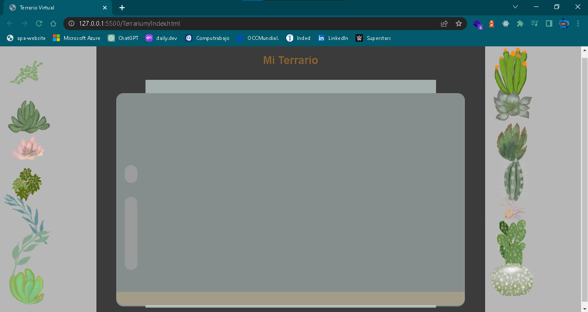
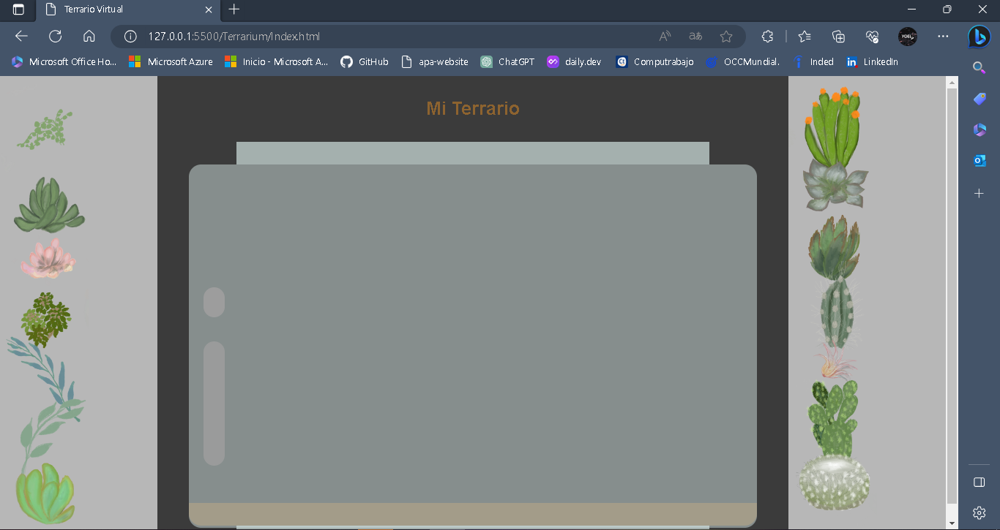
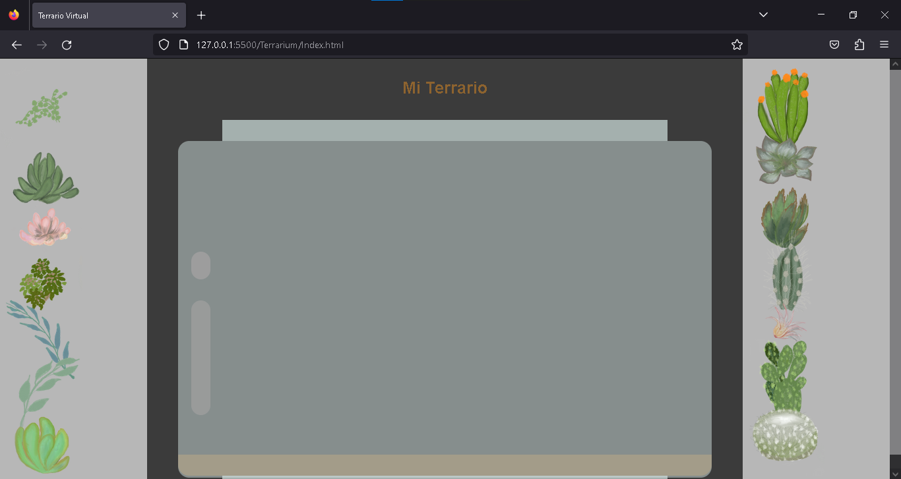
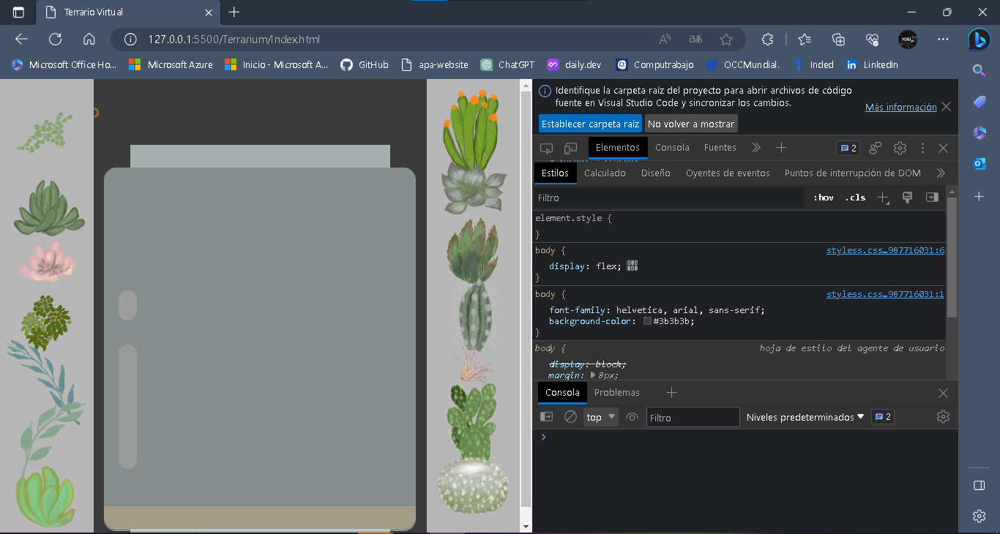

# Refactorización CSS

## Instrucciones

Cambie el estilo del terrario usando Flexbox o CSS Grid, y tome capturas de pantalla para mostrar que lo ha probado en varios navegadores. Es posible que deba cambiar el marcado, así que cree una nueva versión de la aplicación con el arte en su lugar para su refactorización. No se preocupe por hacer que los elementos se puedan arrastrar; solo refactorice el HTML y CSS por ahora.

## Rúbrica

| Criterios | Ejemplar                                                         | Adecuada                      | Necesita mejorar                    |
| -------- | ----------------------------------------------------------------- | ----------------------------- | ------------------------------------ |
|          | Presenta un terrario completamente rediseñado usando Flexbox o CSS Grid | Modifique algunos de los elementos | No cambiar el estilo del terrario en absoluto |

### Cambiando estilos del terrario

Se decidio aplicar la siguiente propiedad usando CSS Grid al archivo de CSS de nuestro proyecto.

```CSS
body{
	display: grid;
}
```
Se probo can ambos tanto con Grid y Flexbox por lo que se tomo como una mejor opción CSS Grid.

Este es resultado en 3 distintos navegadores.

#### Google Chrome

<br/>

#### Microsoft Edge

<br/>

#### Mozilla Firefox

<br/>

Al usar Flexbox se visualiza lo siguiente en cualquier navegador.

```CSS
body{
	display: flex;
}
```

<br/>

Usando esta propiedad algunos de los elementos se mueven de su lugar y no se aprecian de la mejor forma.

#### Esta es la evidencia que corresponde a la <a href="https://github.com/microsoft/Web-Dev-For-Beginners/blob/main/3-terrarium/2-intro-to-css/translations/assignment.es.md">tarea</a> de la lección <a href="https://github.com/microsoft/Web-Dev-For-Beginners/blob/main/3-terrarium/2-intro-to-css/translations/README.es.md">Terrarium Project Parte 2: Introducción a CSS</a> del curso <a href="https://github.com/microsoft/Web-Dev-For-Beginners">WEB DEVELOPMENT FOR BEGINNERS</a> de Microsoft.

