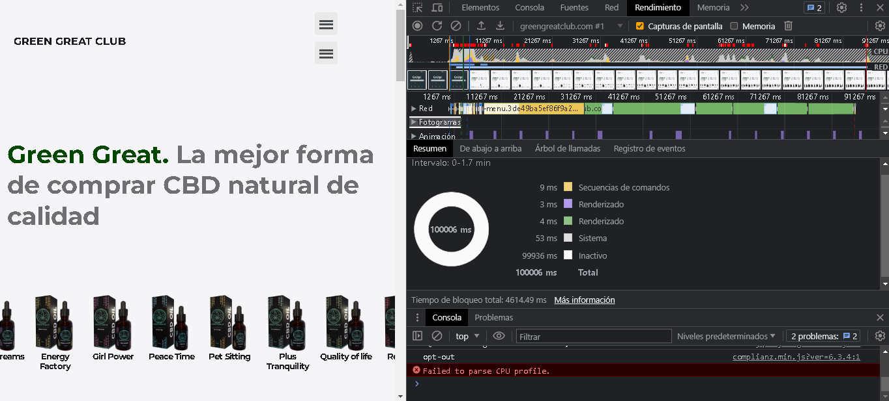

# Analizar el rendimiento de un sitio

Proporcione un informe detallado de un sitio web, que muestre las áreas donde el rendimiento es problemático. Analice por qué el sitio es lento y qué podría hacer para acelerarlo. No confíe solo en las herramientas del navegador, investigue un poco sobre otras herramientas que pueden ayudar a su informe.

## Rúbrica

| Criterios | Ejemplar | Adecuado | Necesita mejorar |
| -------- | -------------------------------------------- | --------------------- | ----------------- |
| | Se presenta un informe con detalles extraídos no solo de las herramientas del navegador, sino también de herramientas de terceros, si están disponibles | Se presenta un informe básico | Se presenta un informe mínimo |

<strong>Informe de problemas de rendimiento en un sitio web</strong>

El siguiente sitio pertenece una marca de productos de CBD y a traves de este sitio ofrecen la comercializacion de sus productos e informacion acerca de y los beneficios del CBD para hombres, mujeres, niños, adultos mayores e incluso para las mascotas.

El primer apunte que se puede visualizar que en la primera carga del sitio tarda mas de un minuto en cargar todas las imagenes del carrucel y algunos otros elementos que se muestran en su homepage.

Al parecer el sitio ha sido desarrollado con el gestor de contenido WordPress el cual puede ayudar a crear sitios web de manera sencilla, pero al usar este tipo de gestores puede incrementar el peso de nuestros sitios.

Al incrementar el peso de los archivos de nuestro sitio puede que no este bien optimizado y carge mas lento el contenido del sitio ya que lo que tarda mas es en cargar el sistema del gestor que se ocupa.

En la siguiente imagen se puede observar un resultado aproximado de la media de peso en KB de un sitio desarrollado en WordPress el cual puede llegar a pesar mas de 2000 KB en sus archivos.

Tambien se ha realizado un <a href="./Docs/InformeGreenGreatClub.pdf">informe de lighthouse</a> el cual muestra estos resultados.

Como se puede observar el apartado de performance señala un resultado de 46 en su puntaje esto se debe a la carga lenta y algunos aspectos del diseño de la interfaz del sitio que se ven relflejados en el informe

En la mayoria de los casos que se llega a utilizar este tipo de gestores de contenido el performance o rendimiento del sitio suele verce afectado ya que dependiendo todos los recursos que se tengan mas los complementos como los plugins que se usen para el funcionamiento del sitio siempre van a pesar o afectar dependiendo de sus caracteristicas.

#### Esta es la evidencia que corresponde a la <a href="https://github.com/microsoft/Web-Dev-For-Beginners/blob/main/5-browser-extension/3-background-tasks-and-performance/translations/assignment.es.md">tarea</a> de la lección <a href="https://github.com/microsoft/Web-Dev-For-Beginners/blob/main/5-browser-extension/3-background-tasks-and-performance/translations/README.es.md">Proyecto de extensión del navegador, parte 3: Más información sobre el rendimiento y las tareas en segundo plano</a> del curso <a href="https://github.com/microsoft/Web-Dev-For-Beginners">WEB DEVELOPMENT FOR BEGINNERS</a> de Microsoft.