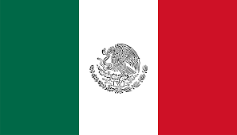
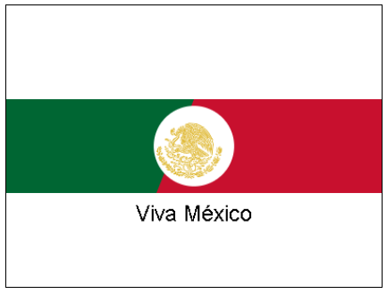

 Juega con la API Canvas

## Instrucciones

Elija un elemento de la API de Canvas y cree algo interesante a su alrededor. ¿Puedes crear una pequeña galaxia de estrellas repetidas? ¿Puedes crear una textura interesante de líneas de colores? Puede buscar inspiración en CodePen (pero no copiar)

## Rúbrica

| Criterios | Ejemplar | Adecuado | Necesita mejorar |
| -------- | ----- | --- | - |
| |  El código se envía mostrando una textura o forma interesante| Se envía el código, pero no se ejecuta  | No se envía el código |

<strong>Dibujando con API Canvas</strong>

Para el dibujo se ha elaborado una variacion de diseño utilizando los elementos de la bandera de México.



Primero se define el lienzo para dibujar en el html.

```HTML
<canvas id="mexicoFlag" width="400" height="300" style="border:1px solid black;"></canvas>
```

Ahora trabajamos con las funcionalidades del API Canvas para crear la variante de diseño.

```JavaScript
// Obtenemos el lienzo
        const canvas = document.getElementById('mexicoFlag');
        const ctx = canvas.getContext('2d');

        // Dibujamos el fondo blanco
        ctx.fillStyle = 'white';
        ctx.fillRect(0, 0, canvas.width, canvas.height);

        // Dibujamos la franja verde
        ctx.fillStyle = '#006633'; 
        ctx.fillRect(0, canvas.height / 3, canvas.width, canvas.height / 3);

        // Dibujamos el escudo y la franja roja
        ctx.fillStyle = '#C8102E';
        ctx.beginPath();
        ctx.moveTo(canvas.width / 2, canvas.height / 3);
        ctx.lineTo(canvas.width * 1000 / 5, canvas.height * 2 / 3);
        ctx.lineTo(canvas.width * 2 / 5, canvas.height * 2 / 3);
        ctx.fill();
        ctx.closePath();

        // Dibujamos el círculo en el centro del escudo
        ctx.fillStyle = 'white';
        ctx.beginPath();
        ctx.arc(canvas.width / 2, canvas.height / 2, canvas.height / 7, 0, 9 * Math.PI);
        ctx.fill();
        ctx.closePath();

        // Dibujamos el águila
        const img = new Image();
        img.src = 'https://upload.wikimedia.org/wikipedia/commons/6/69/Coat_of_arms_of_Mexico_%28golden_linear%29.svg';
        img.onload = function() {
            ctx.drawImage(img, canvas.width / 2 - 40, canvas.height / 2 - 25, 70, 60);
        };

        // Dibujamos el texto "Viva México"
        ctx.fillStyle = 'Black';
        ctx.font = '24px Arial';
        ctx.textAlign = 'center';
        ctx.fillText('Viva México', canvas.width / 2, (canvas.height * 2) / 3 + 30);
```

Al final se obtiene este resultado: 



#### Esta es la evidencia que corresponde a la <a href="https://github.com/microsoft/Web-Dev-For-Beginners/blob/main/6-space-game/2-drawing-to-canvas/translations/assignment.es.md">tarea</a> de la lección <a href="https://github.com/microsoft/Web-Dev-For-Beginners/blob/main/6-space-game/2-drawing-to-canvas/translations/README.es.md">Construye un juego espacial Parte II: Dibuja héroes y monstruos en el lienzo</a> del curso <a href="https://github.com/microsoft/Web-Dev-For-Beginners">WEB DEVELOPMENT FOR BEGINNERS</a> de Microsoft.