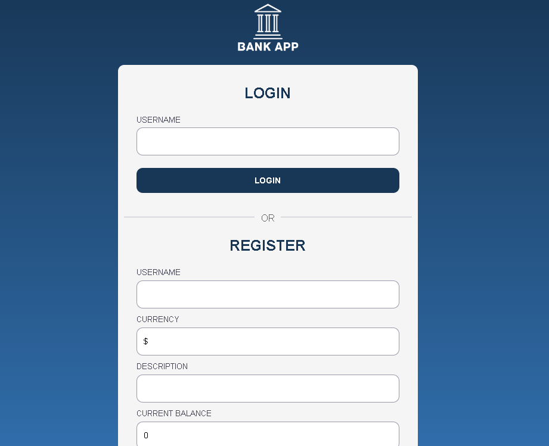
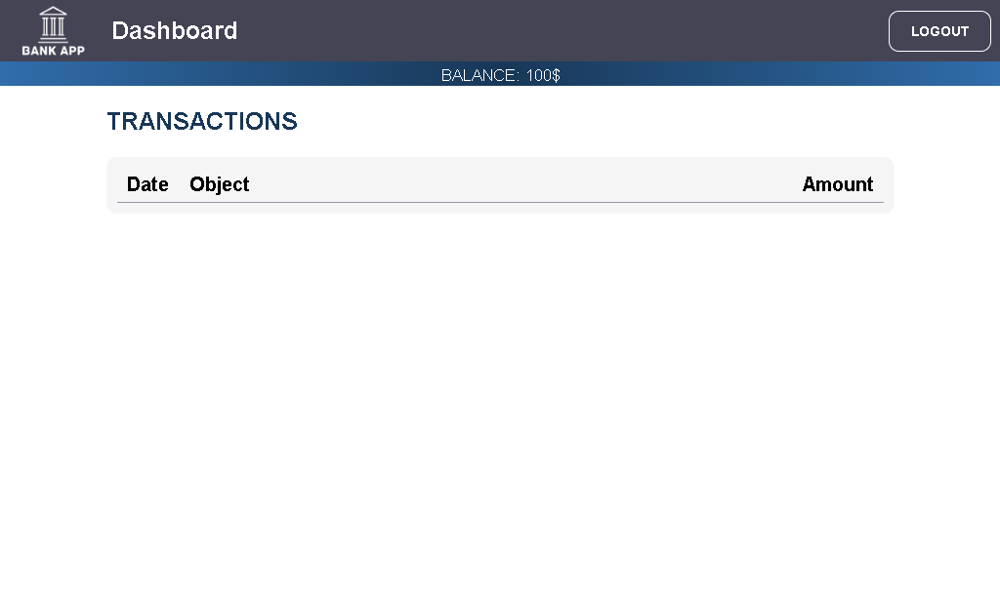
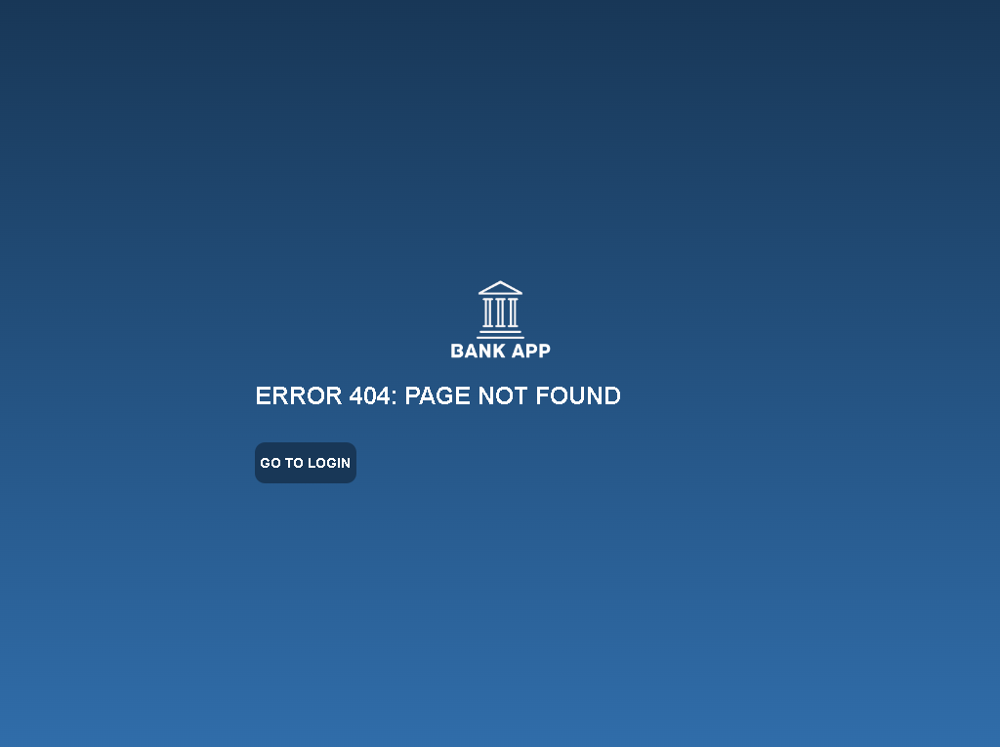

# Diseña tu aplicación bancaria

## Instrucciones

Cree un nuevo archivo `styles.css` y agréguele un enlace en su archivo `index.html` actual. En el archivo CSS que acaba de crear, agregue algunos estilos para que la página *Inicio de sesión* y *Panel de control* se vea bien y ordenada. Intente crear un tema de color para darle a su aplicación su propia marca.

> Consejo: puede modificar el HTML y agregar nuevos elementos y clases si es necesario.

## Rúbrica

| Criterios | Ejemplar | Adecuado | Necesita mejorar |
| -------- | ------------------- | ---------------------------- | ------------------------------------------- |
| | Todas las páginas se ven limpias y legibles, con un tema de color consistente y las diferentes secciones destacando correctamente. | Las páginas tienen un estilo pero sin un tema o con secciones no claramente delimitadas. | Las páginas carecen de estilo, las secciones se ven desorganizadas y la información es difícil de leer. |

<strong>Estilos de Diseño para la aplicación</strong>

Para agregar los estilos de diseño se modificaron las plantillas ya creadas del archivo `index.html` agregando etiquetas `<div>` y clases a estas etiquetas asi como también a algunas ya existentes.

```HTML
<!--Plantilla para el inicio de sesion y registros de usuario-->
    <template id="login">
        <section class="login-page">
            <div class="login-container">
                <div class="login-title text-center">
                    
                </div>
                <div class="login-content">
                    <h1></h1>
                    <h2 class="text-center">Login</h2>
                    <form id="loginForm">
                        <label for="user">Username</label>
                        <input name="user" type="text">
                        <button onclick="navigate('/dashboard')">Login</button>
                    </form>
                    <p class="login-separator text-center"><span>OR</span></p>
                    <h2 class="text-center">Register</h2>
                    <form id="registerForm" action="javascript:register()">
                        <label for="user">Username</label>
                        <input name="user" type="text" maxlength="20" required>
                        <label for="currency">Currency</label>
                        <input name="currency" type="text" value="$" maxlength="5" required>
                        <label for="description">Description</label>
                        <input name="description" type="text" maxlength="100">
                        <label for="balance">Current balance</label>
                        <input name="balance" type="number" value="0">
                        <button>Register</button>
                    </form>
                </div>
            </div>
        </section>
    </template>

    <!--Plantilla para el centro de control/ Dashboard-->
    <template id="dashboard">
        <section class="dashboard-page">
            <header class="dashboard-header">
                
                <h1 class="dashboard-title hide-xs">Dashboard</h1>
                <button onclick="navigate('/login')">Logout</button><!--Boton: cerrar sesión-->
            </header>
            <div class="balance">
                <div>Balance: 100$</div> <!--Saldo actual de la cuenta bancaria-->
                <!--Lista de transacciones, que se muestra en una tabla.-->
            </div>
            <div class="dashboard-content">
                <h2>Transactions</h2>
                <table class="transactions-table" aria-label="Transactions">
                    <thead>
                        <tr>
                            <th>Date</th>
                            <th>Object</th>
                            <th>Amount</th>
                        </tr>
                    </thead>
                    <tbody id="transactions"></tbody>
                </table>
            </div>
        </section>

    </template>

    <template id="transaction">
        <tr>
          <td></td>
          <td></td>
          <td></td>
        </tr>
    </template>

    <!--404-->
    <template id="404">
        <section class="Error-page">
            <div class="Error-container">
                <div class="Error-title text-center">
                    
                </div>
                <h2>Error 404: page not found</h2>
            
                <button onclick="navigate('/login')">Go to Login</button>
            </div>
        </section>
    </template>
```

También se creó un archivo `styless.css` junto con las clases agregadas al archivo `index.html` para agregar los estilos de diseño a las interfaces de la aplicación web.

```CSS
:root {
    /* Colors */
    --primary: #183757;
    --secondary: #ffffff;
    --primary-light: #306daa;
    --accent: #546e7a;
    --grey: #445;
    --error: #f52;
    --background: #f5f5f6;
    --background-accent: #cfe5f2;
    --white: #fff;
    --border: #99a;
    /* Sizes */
    --radius: 10px;
    --space-xs: 5px;
    --space-sm: 10px;
    --space-md: 20px;
    --space-xl: 40px;
  }
  
  /* ------------------------------------------------------------------------ */
  /* Micro reset */
  /* ------------------------------------------------------------------------ */
  
  * {
    box-sizing: border-box;
  }
  
  html, body, #app {
    margin: 0;
    padding: 0;
    height: 100%;
  }
  
  /* ------------------------------------------------------------------------ */
  /* General styles */
  /* ------------------------------------------------------------------------ */
  
  body {
    font-family: Arial, Helvetica, sans-serif;
    font-size: 16px;
  }
  
  h2 {
    color: var(--primary);
    text-transform: uppercase;
    font-weight: bold;
    font-size: 1.5rem;
    margin: var(--space-md) 0;
  }
  
  form {
    display: flex;
    flex-direction: column;
    margin: var(--space-sm) var(--space-md);
  }
  
  input {
    margin-top: var(--space-xs);
    margin-bottom: var(--space-sm);
    height: 45px;
    padding: var(--space-xs) var(--space-sm);
    border: 1px solid var(--border);
    border-radius: var(--radius);
  }
  
  input:focus {
    border-color: var(--primary);
    outline: 0;
  }
  
  label {
    color: var(--grey);
    text-transform: uppercase;
    font-size: 80%;
  }
  
  button {
    font-weight: bold;
    background-color: var(--primary);
    color: var(--white);
    height: 40px;
    padding: var(--space-xs);
    border: 0;
    border-radius: var(--radius);
    text-transform: uppercase;
    min-width: 100px;
    margin: var(--space-sm) 0;
  }
  
  .button-alt {
    background-color: transparent;
    color: var(--primary);
  }
  
  button:hover {
    filter: brightness(115%);
    cursor: pointer;
  }
  
  button:focus {
    outline: none;
    border: 3px solid var(--grey);
  }
  
  .error {
    color: var(--error);
    margin: var(--space-xs) 0;
  }
  
  .error:empty {
    display: none;
  }
  
  /* ------------------------------------------------------------------------ */
  /* Login page */
  /* ------------------------------------------------------------------------ */
  
  .login-title {
    font-size: 2rem;
    font-weight: bold;
    color: var(--white);
    margin: var(--space-md);
  }
  
  .login-logo {
    height: 80px;
    vertical-align: middle;
  }
  
  .login-page {
    display: flex;
    height: 100%;
    align-items: center;
    justify-content: center;
    background: linear-gradient(var(--primary), var(--primary-light));
  }
  
  .login-container {
    flex: auto;
    max-width: 480px;
    max-height: 100%;
    overflow: auto;
  }
  
  .login-content {
    background-color: var(--background);
    padding: var(--space-sm);
  }
  
  .login-separator {
    position: relative;
    top: 0.5em;
    border-top: 1px solid var(--border);
    opacity: 0.6;
    margin: var(--space-md) 0;
  }
  
  .login-separator > span {
    position: relative;
    top: -0.5em;
    background-color: var(--background);
    padding: var(--space-sm);
  }
  
  /* ------------------------------------------------------------------------ */
  /* Dashboard page */
  /* ------------------------------------------------------------------------ */
  
  .dashboard-page {
    display: flex;
    height: 100%;
    flex-direction: column;
  }
  
  .dashboard-header {
    background-color: var(--grey);
    padding: 0 var(--space-sm)
  }
  
  .dashboard-header button {
    float: right;
    border: 1px solid;
    background-color: transparent;
  }
  
  .dashboard-title {
    font-size: 1.5rem;
    font-weight: bold;
    color: var(--white);
    vertical-align: middle;
    margin: 0 var(--space-sm)
  }
  
  .dashboard-logo {
    height: 60px;
    vertical-align: middle;
    padding: var(--space-xs);
  }
  
  .balance {
    background: radial-gradient(circle at center, var(--primary), var(--primary-light));
    text-align: center;
  }
  
  .balance > div {
    color: var(--white);
    padding-top: var(--space-xs);
    text-transform: uppercase;
  }
  
  .balance > span {
    color: var(--white);
    font-size: 3rem;
  }
  
  .transactions-title {
    display: flex;
    justify-content: space-between;
    align-items: center;
    padding: 0 var(--space-sm);
    color: var(--accent);
    font-weight: bold;
    font-size: 1.5rem;
  }
  
  .transactions-title > div {
    overflow: hidden;
    text-overflow: ellipsis;
    white-space: nowrap;
  }
  
  .transactions-table {
    width: 100%;
    font-size: 1.2rem;
    padding: var(--space-sm);
    margin: 0;
    border-spacing: 0;
    background-color: var(--background);
  }
  
  .transactions-table thead th {
    border-bottom: 1px solid var(--border);
  }
  
  .transactions-table tr:nth-child(even) {
    background-color: var(--background-accent);
  }
  
  .transactions-table td,
  .transactions-table th {
    padding: var(--space-xs) var(--space-sm);
    text-align: left;
  }
  
  .transactions-table td:first-child,
  .transactions-table th:first-child {
    /* Make first column use the minimum width */
    width: 1%;
    white-space: nowrap;
  }
  
  .transactions-table td:last-child,
  .transactions-table th:last-child {
    text-align: right;
  }
  
  .dialog {
    display: none;
    position: absolute;
    top: 0;
    left: 0;
    right: 0;
    bottom: 0;
    left: 0;
    top: 0;
    overflow: auto;
    background-color: rgba(0,0,0,0.4);
    animation: slideFromTop 0.3s ease-in-out;
    justify-content: center;
    align-items: flex-start;
  }
  
  .dialog.show {
    display: flex;
  }
  
  @keyframes slideFromTop {
    from {
      top: -300px;
      opacity: 0;
    }
    to {
      top: 0;
      opacity: 1;
    }
  }
  
  .dialog-content {
    flex: auto;
    background-color: var(--white);
    max-width: 480px;
    max-height: 100%;
    padding: var(--space-sm);
  }
  
  .dialog-buttons {
    text-align: right;
  }
  
  
  /* ------------------------------------------------------------------------ */
  /* 404 */
  /* ------------------------------------------------------------------------ */
  .Error-page {
    display: flex;
    height: 100%;
    align-items: center;
    justify-content: center;
    background: linear-gradient(var(--primary), var(--primary-light));
  }

  .Error-page .Error-container h2{
    color: #ffffff;
  }

  .Error-container {
    flex: auto;
    max-width: 480px;
    max-height: 100%;
    overflow: auto;
  }

  .Error-title {
    font-size: 2rem;
    font-weight: bold;
    color: var(--white);
    margin: var(--space-md);
  }

  .Error-logo {
    height: 80px;
    vertical-align: middle;
  }

  /* ------------------------------------------------------------------------ */
  /* Utilities */
  /* ------------------------------------------------------------------------ */
  
  .text-center {
    text-align: center;
  }
  
  .hide-xs {
    display: none;
  }
```

Aparte de esto también se agregaron las adaptaciones para el diseño responsive de la aplicación.

```CSS
/* ------------------------------------------------------------------------ */
  /* Responsive adaptations */
  /* ------------------------------------------------------------------------ */
  
  @media only screen and (min-width: 480px) {
    .hide-xs {
      display: initial;
    }
  
    .login-content,
    .dialog-content {
      border-radius: var(--radius);
    }
  
    .dialog-content {
      margin-top: var(--space-xl);
    }
  }
  
  @media only screen and (min-width: 768px) {
    .transactions-table {
      border-radius: var(--radius);
    }
  
    .dashboard-content {
      width: 100%;
      max-width: 768px;
      align-self: center;
    }
  }
```

### Resultados finales

1. Interfaz para el inicio de sesión:



2. Dashboard



3. Página de error



Ahora todas las páginas de la app tienen un diseño en su interfaz de usuario lo cual la hace verse más limpia y organizada la aplicación web.

#### Esta es la evidencia que corresponde a la <a href="https://github.com/microsoft/Web-Dev-For-Beginners/blob/main/7-bank-project/2-forms/translations/assignment.es.md">tarea</a> de la lección <a href="https://github.com/microsoft/Web-Dev-For-Beginners/blob/main/7-bank-project/2-forms/translations/README.es.md">Proyecto de Construir un banco, parte 2: Cree un formulario de inicio de sesión y registro</a> del curso <a href="https://github.com/microsoft/Web-Dev-For-Beginners">WEB DEVELOPMENT FOR BEGINNERS</a> de Microsoft.