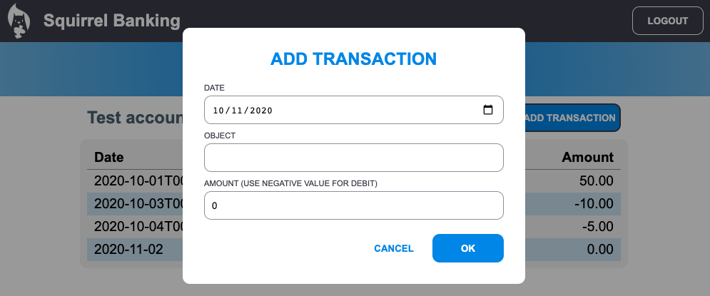

# Implementar el diálogo "Agregar transacción"

## Instrucciones

A nuestra aplicación bancaria todavía le falta una característica importante: la posibilidad de ingresar nuevas transacciones.
Utilizando todo lo que ha aprendido en las cuatro lecciones anteriores, implemente un cuadro de diálogo "Agregar transacción":

- Agregue un botón "Agregar transacción" en la página del panel
- Cree una nueva página con una plantilla HTML o use JavaScript para mostrar / ocultar el cuadro de diálogo HTML sin salir de la página del tablero (puede usar [`hidden`](https://developer.mozilla.org/docs/Web/HTML/Global_attributes/hidden) para eso, o clases CSS)
- Implementar un formulario HTML para recibir datos de entrada.
- Cree datos JSON a partir de los datos del formulario y envíelos a la API
- Actualiza la página del tablero con los nuevos datos.

Mire las [especificaciones de la API del servidor](./img/image.png) para ver a qué API debe llamar y cuál es el formato JSON esperado.

Aquí hay un ejemplo de resultado después de completar la tarea:

## Rúbrica

| Criterios | Ejemplar | Adecuado | Necesita mejorar |
| -------- |  ------- | --------------------------------------------------  | -------------------------------------------------- |
| | La adición de una transacción se implementa completamente siguiendo todas las mejores prácticas que se ven en las lecciones. | Agregar una transacción está implementado, pero no siguiendo las mejores prácticas que se ven en las lecciones, o trabajando solo parcialmente. | Agregar una transacción no funciona en absoluto. |
