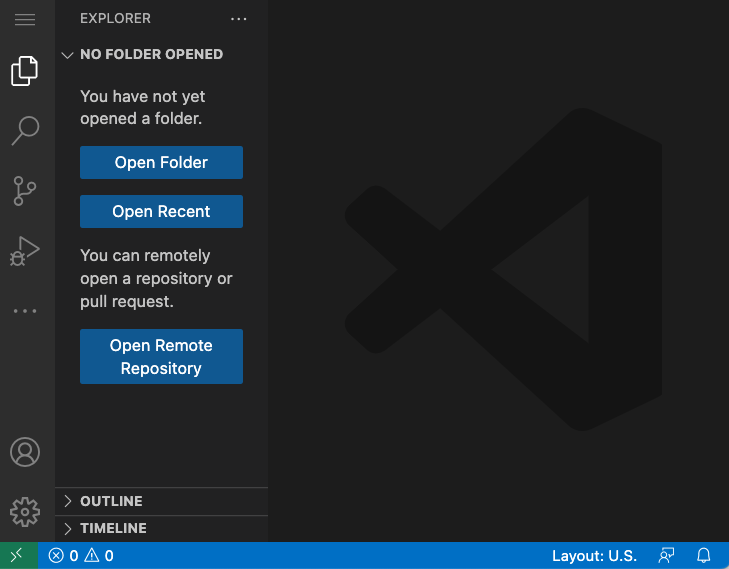
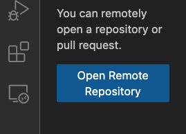
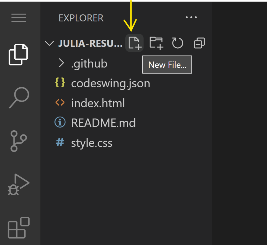
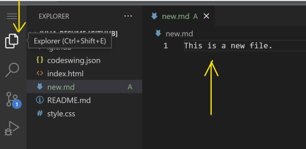
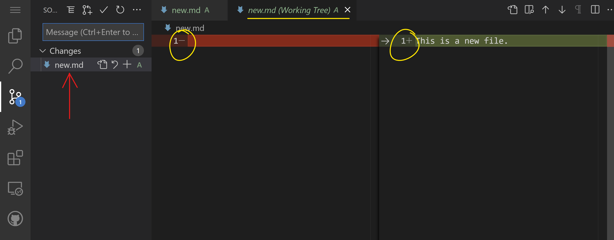
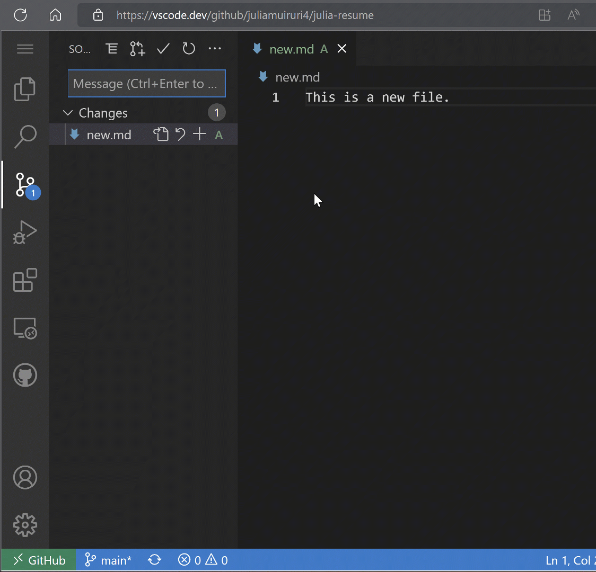
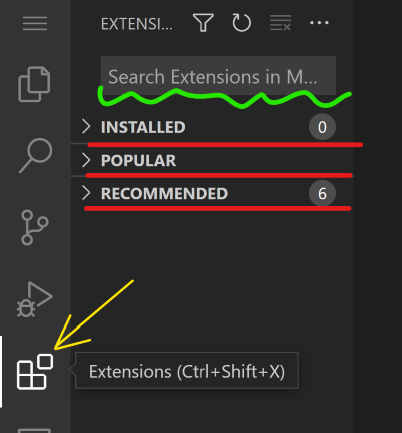
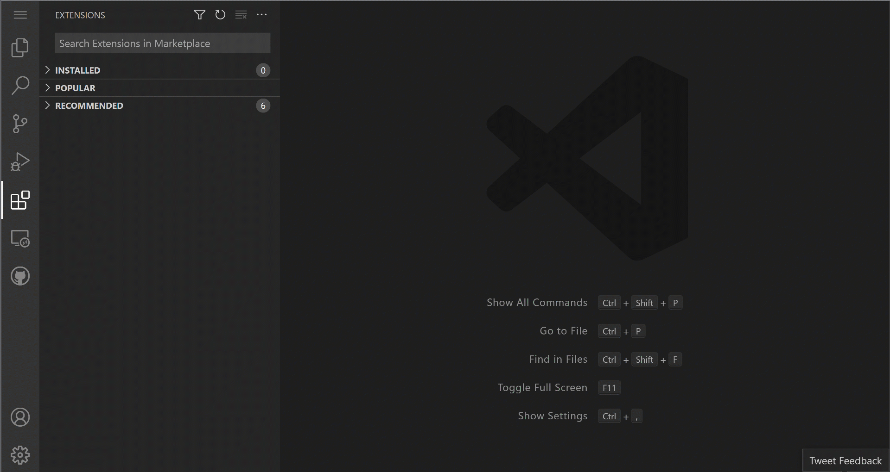
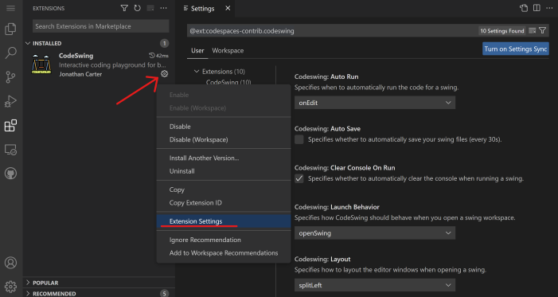

# Usando un editor de código

Esta lección cubre los conceptos básicos del uso de  [VSCode.dev](https://vscode.dev) un editor de código basado en web, para que pueda realizar cambios en su código y contribuir a un proyecto sin instalar nada en su computadora.


 


[Pre-lecture quiz](https://ashy-river-0debb7803.1.azurestaticapps.net/quiz/3)

## Objetivos de aprendizaje
En esta lección, aprenderá cómo:

- Utilice un editor de código en un proyecto de código
- Realice un seguimiento de los cambios con el control de versiones
- Personaliza el editor para el desarrollo.

### Requisitos previos
Antes de comenzar, deberá crear una cuenta en [GitHub](https://github.com). Navegue a [GitHub](https://github.com) y cree una cuenta si aún no lo ha hecho.

### Introducción
Un editor de código es una herramienta esencial para escribir programas y colaborar con proyectos de codificación existentes. Una vez que comprenda los conceptos básicos de un editor y cómo utilizar sus funciones, podrá aplicarlos al escribir código.

## Comenzando con VSCode.dev
[VSCode.dev](https://vscode.dev) es un editor de código en la web. No necesitas instalar nada para usarlo, como abrir cualquier otro sitio web. Para comenzar con el editor, abra el siguiente enlace: https://vscode.dev . Si no ha iniciado sesión en GitHub , siga las instrucciones para iniciar sesión o crear una cuenta nueva y luego iniciar sesión.

Una vez que se cargue, debería verse similar a esta imagen:



Hay tres secciones principales, comenzando desde el extremo izquierdo y avanzando hacia la derecha:

1. La barra de actividades que incluye algunos íconos, como la lupa 🔎, el engranaje ⚙️ y algunos otros.
2. La barra de actividad expandida que por defecto es el Explorador , se llama barra lateral .
3. Y finalmente, el área de códigos a la derecha.

Haga clic en cada uno de los iconos para mostrar un menú diferente. Una vez hecho esto, haga clic en el Explorador para volver al punto de partida.

Cuando comience a crear código o modificar el código existente, sucederá en el área más grande a la derecha. También utilizará esta área para visualizar el código existente, lo cual hará a continuación.

## Abrir un repositorio de GitHub
Lo primero que necesitarás es abrir un repositorio de GitHub. Hay varias formas de abrir un repositorio. En esta sección verá dos formas diferentes de abrir un repositorio para poder comenzar a trabajar en los cambios.

### 1. Con el editor
Utilice el propio editor para abrir un repositorio remoto. Si va a VSCode.dev, verá el botón "Abrir repositorio remoto" :



También puede utilizar la paleta de comandos. La paleta de comandos es un cuadro de entrada donde puede escribir cualquier palabra que forme parte de un comando o acción para encontrar el comando correcto para ejecutar. Use el menú en la parte superior izquierda, luego seleccione Ver y luego elija Paleta de comandos , o use el siguiente método abreviado de teclado: Ctrl-Shift-P (en MacOS sería Comando-Shift-P).


Una vez que se abra el menú, escriba abrir repositorio remoto y luego seleccione la primera opción. Aparecerán varios repositorios de los que forma parte o que ha abierto recientemente. También puedes usar una URL completa de GitHub para seleccionar una. Utilice la siguiente URL y péguela en el cuadro:

```
https://github.com/microsoft/Web-Dev-For-Beginners
```
✅ Si tiene éxito, verá todos los archivos de este repositorio cargados en el editor de texto.

### 2. Usando la URL
También puedes usar una URL directamente para cargar un repositorio. Por ejemplo, la URL completa del repositorio actual es https://github.com/microsoft/Web-Dev-For-Beginners , pero puede intercambiar el dominio de GitHub VSCode.dev/githuby cargar el repositorio directamente. La URL resultante sería https://vscode.dev/github/microsoft/Web-Dev-For-Beginners.

## Editar archivos
Una vez que haya abierto el repositorio en el navegador/vscode.dev, el siguiente paso sería realizar actualizaciones o cambios en el proyecto.

### 1. Crea un nuevo archivo
Puede crear un archivo dentro de una carpeta existente o crearlo en la carpeta/directorio raíz. Para crear un nuevo archivo, abra una ubicación/directorio en el que desea guardar el archivo y seleccione el ícono 'Nuevo archivo...' en la barra de actividades (izquierda) , asígnele un nombre y presione Enter.



### 2. Edite y guarde un archivo en el repositorio.
Usar vscode.dev es útil siempre que desee realizar actualizaciones rápidas en su proyecto sin tener que cargar ningún software localmente. Para actualizar su código, haga clic en el ícono 'Explorador', también ubicado en la barra de actividades para ver archivos y carpetas en el repositorio. Seleccione un archivo para abrirlo en el área de código, realice los cambios y guárdelo.



Una vez que haya terminado de actualizar su proyecto, seleccione el _`source control`_ ícono que contiene todos los nuevos cambios que ha realizado en su repositorio.

Para ver los cambios que realizó en su proyecto, seleccione los archivos en la carpeta `Changes` en la barra de actividad expandida. Esto abrirá un 'Árbol de trabajo' para que pueda ver visualmente los cambios que realizó en el archivo. El rojo muestra una omisión en el proyecto, mientras que el verde significa una adición.



Si está satisfecho con los cambios que realizó, coloque el cursor sobre la carpeta `Changes` y haga clic en el botón `+` para organizar los cambios. La puesta en escena simplemente significa preparar los cambios para enviarlos a GitHub.

Sin embargo, si no se siente cómodo con algunos cambios y desea descartarlos, coloque el cursor sobre la carpeta `Changes` y seleccione el icono `undo`.

Luego, escriba un `commit message` (Una descripción del cambio que ha realizado en el proyecto) , haga clic en `Check icon` para confirmar y enviar sus cambios.

Una vez que haya terminado de trabajar en su proyecto, seleccione `hamburger menu icon` en la parte superior izquierda para regresar al repositorio en github.com.



## Usando extensiones
La instalación de extensiones en VSCode le permite agregar nuevas funciones y opciones de entorno de desarrollo personalizadas en su editor para mejorar su flujo de trabajo de desarrollo. Estas extensiones también lo ayudan a agregar soporte para múltiples lenguajes de programación y, a menudo, son extensiones genéricas o extensiones basadas en lenguajes.

Para explorar la lista de todas las extensiones disponibles, haga clic en en _`Extensions icon`_ la barra de actividad y comience a escribir el nombre de la extensión en el campo de texto denominado "Buscar extensiones en Marketplace" . Verá una lista de extensiones, cada una de las cuales contiene <strong>el nombre de la extensión, el nombre del editor, una descripción de una frase, el número de descargas y una calificación de estrellas.</strong>


También puede ver todas las extensiones instaladas previamente expandiendo las Installed folderextensiones populares utilizadas por la mayoría de los desarrolladores en el Popular foldery las extensiones recomendadas por los usuarios en el mismo espacio de trabajo o en función de los archivos abiertos recientemente en el archivo recommended folder.



### 1. Instalar extensiones
Para instalar una extensión, escriba el nombre de la extensión en el campo de búsqueda y haga clic en él para ver información adicional sobre la extensión en el área de código una vez que aparezca en la barra de actividad expandida.

Puede hacer clic en el botón azul de instalación en la barra de actividad expandida para instalar o usar el botón de instalación que aparece en el área de código una vez que selecciona la extensión para cargar información adicional.



### 2. Personalizar extensiones
Después de instalar la extensión, es posible que deba modificar su comportamiento y personalizarla según sus preferencias. Para hacer esto, seleccione el ícono de Extensiones y esta vez, su extensión aparecerá en la carpeta Instalada , haga clic en el ícono de ajustes y navegue hasta Configuración de extensiones.



### 3. Administrar extensiones
Después de instalar y usar su extensión, vscode.dev ofrece opciones para administrar su extensión según las diferentes necesidades. Por ejemplo, puede optar por:

- Deshabilitar: (Deshabilitas temporalmente una extensión cuando ya no la necesitas pero no quieres desinstalarla por completo)

- Seleccione la extensión instalada en la barra de actividad expandida > haga clic en el ícono de ajustes > seleccione 'Desactivar' o 'Desactivar (espacio de trabajo)' O Abra la extensión en el área de código y haga clic en el botón azul Desactivar.

- Desinstalar: seleccione la extensión instalada en la barra de actividad expandida> haga clic en el ícono de ajustes> seleccione 'Desinstalar' O abra la extensión en el área de código y haga clic en el botón azul Desinstalar.

## Asignación
[Cree un sitio web de currículum usando vscode.dev](Tarea.md)

## Revisión y autoestudio
Lea más sobre  [VSCode.dev](https://code.visualstudio.com/docs/editor/vscode-web?WT.mc_id=academic-0000-alfredodeza) y algunas de sus otras características.


