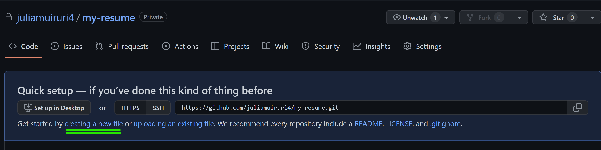
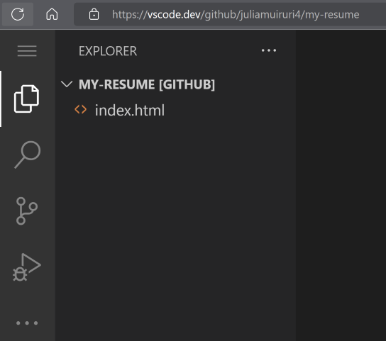
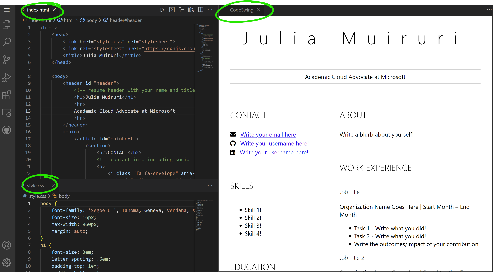

# Cree un sitio web de currículum usando vscode.dev

_¿Qué tan genial sería que un reclutador te pidiera tu currículum y le enviaras una URL?_ 😎

<!----
TODO: add an optional image

> Sketchnote by [Author name](https://example.com)
---->

<!---
## Pre-Lecture Quiz
[Pre-lecture quiz](https://ashy-river-0debb7803.1.azurestaticapps.net/quiz/3)
---->

## Objectivos

Después de esta tarea, aprenderá a:

- Crea un sitio web para mostrar tu currículum

### Requisitos previos

1. Una cuenta de GitHub. Navegue a[GitHub](https://github.com/) y cree una cuenta si aún no lo ha hecho.

## Pasos

**Paso 1:** Create a new GitHub Repository and give it a name `my-resume`


**Paso 2:** Crea un archivo `index.html` file en tu repositorio. Agregaremos al menos un archivo mientras aún esté en github.com porque no puede abrir un repositorio vacío en vscode.dev

Haga clic en el enlace `creating a new file` link, escriba el nombre `index.html` y seleccione el boton `Commit new file` 




**Paso 3:** Open [VSCode.dev](https://vscode.dev) and select the `Open Remote Repository` button

Copy the url to the repository you just created for your resume site and paste it in the input box:

_Reemplace `your-username` con su nombre de usuario de github_

```
https://github.com/your-username/my-resume
```

✅ Si tiene éxito, verá su proyecto y el archivo index.html abrirse en el editor de texto del navegador.




**Paso 4:** Abra el archivo `index.html`, pegue el siguiente código en su área de códigos y guárdelo

<details>
    <summary><b>Código HTML responsable del contenido del sitio web de su currículum.</b></summary>
    
        <html>

            <head>
                <link href="style.css" rel="stylesheet">
                <link rel="stylesheet" href="https://cdnjs.cloudflare.com/ajax/libs/font-awesome/5.15.4/css/all.min.css">
                <title>Your Name Goes Here!</title>
            </head>
            <body>
                <header id="header">
                    <!-- resume header with your name and title -->
                    <h1>Your Name Goes Here!</h1>
                    <hr>
                    Your Role!
                    <hr>
                </header>
                <main>
                    <article id="mainLeft">
                        <section>
                            <h2>CONTACT</h2>
                            <!-- contact info including social media -->
                            <p>
                                <i class="fa fa-envelope" aria-hidden="true"></i>
                                <a href="mailto:username@domain.top-level domain">Write your email here</a>
                            </p>
                            <p>
                                <i class="fab fa-github" aria-hidden="true"></i>
                                <a href="github.com/yourGitHubUsername">Write your username here!</a>
                            </p>
                            <p>
                                <i class="fab fa-linkedin" aria-hidden="true"></i>
                                <a href="linkedin.com/yourLinkedInUsername">Write your username here!</a>
                            </p>
                        </section>
                        <section>
                            <h2>SKILLS</h2>
                            <!-- your skills -->
                            <ul>
                                <li>Skill 1!</li>
                                <li>Skill 2!</li>
                                <li>Skill 3!</li>
                                <li>Skill 4!</li>
                            </ul>
                        </section>
                        <section>
                            <h2>EDUCATION</h2>
                            <!-- your education -->
                            <h3>Write your course here!</h3>
                            <p>
                                Write your institution here!
                            </p>
                            <p>
                                Start - End Date
                            </p>
                        </section>            
                    </article>
                    <article id="mainRight">
                        <section>
                            <h2>ABOUT</h2>
                            <!-- about you -->
                            <p>Write a blurb about yourself!</p>
                        </section>
                        <section>
                            <h2>WORK EXPERIENCE</h2>
                            <!-- your work experience -->
                            <h3>Job Title</h3>
                            <p>
                                Organization Name Goes Here | Start Month – End Month
                            </p>
                            <ul>
                                    <li>Task 1 - Write what you did!</li>
                                    <li>Task 2 - Write what you did!</li>
                                    <li>Write the outcomes/impact of your contribution</li>
                                    
                            </ul>
                            <h3>Job Title 2</h3>
                            <p>
                                Organization Name Goes Here | Start Month – End Month
                            </p>
                            <ul>
                                    <li>Task 1 - Write what you did!</li>
                                    <li>Task 2 - Write what you did!</li>
                                    <li>Write the outcomes/impact of your contribution</li>
                                    
                            </ul>
                        </section>
                    </article>
                </main>
            </body>
        </html>
</details>

Agregue los detalles de su currículum para reemplazar el _texto del marcador de posición_ en el código html

**Paso 5:** coloque el cursor sobre la carpeta Mi currículum, haga clic en el icono `New File ...` y cree 2 archivos nuevos en su proyecto: `style.css` y `codeswing.json`

**Paso 6:** Abra el archivo `style.css`, pegue el código siguiente y guárdelo

 <details>
        <summary><b>Código CSS para formatear el diseño del sitio.</b></summary>
            
            body {
                font-family: 'Segoe UI', Tahoma, Geneva, Verdana, sans-serif;
                font-size: 16px;
                max-width: 960px;
                margin: auto;
            }
            h1 {
                font-size: 3em;
                letter-spacing: .6em;
                padding-top: 1em;
                padding-bottom: 1em;
            }

            h2 {
                font-size: 1.5em;
                padding-bottom: 1em;
            }

            h3 {
                font-size: 1em;
                padding-bottom: 1em;
            }
            main { 
                display: grid;
                grid-template-columns: 40% 60%;
                margin-top: 3em;
            }
            header {
                text-align: center;
                margin: auto 2em;
            }

            section {
                margin: auto 1em 4em 2em;
            }

            i {
                margin-right: .5em;
            }

            p {
                margin: .2em auto
            }

            hr {
                border: none;
                background-color: lightgray;
                height: 1px;
            }

            h1, h2, h3 {
                font-weight: 100;
                margin-bottom: 0;
            }
            #mainLeft {
                border-right: 1px solid lightgray;
            }
            
</details>

**Paso 6:** Abra el archivo`codeswing.json`, pegue el código siguiente y guárdelo

    {
    "scripts": [],
    "styles": []
    }


**Paso 7:** Instale `Codeswing extension` para visualizar el sitio web del currículum en el área de código. 

Haga clic en el icono _`Extensions`_ en la barra de actividades y escriba Codeswing. Haga clic en el botón azul de instalación en la barra de actividad expandida para instalar o use el botón de instalación que aparece en el área de código una vez que seleccione la extensión para cargar información adicional. Inmediatamente después de instalar la extensión, observe su área de código para ver los cambios en su proyecto 😃


Esto es lo que verá en su pantalla después de instalar la extensión.



Si está satisfecho con los cambios que realizó, coloque el cursor sobre la Changescarpeta y haga clic en el +botón para organizar los cambios.

Escriba un mensaje de confirmación (una descripción del cambio que ha realizado en el proyecto) y confirme sus cambios haciendo clic en `check`. Una vez que haya terminado de trabajar en su proyecto, seleccione el ícono del menú de hamburguesa en la parte superior izquierda para regresar al repositorio en GitHub.

Felicitaciones 🎉 Acaba de crear el sitio web de su currículum usando vscode.dev en unos pocos pasos.

## 🚀 Desafío

Abra un repositorio remoto, tenga permisos para realizar cambios y actualizar algunos archivos. A continuación, intente crear una nueva rama con sus cambios y realice una solicitud de extracción.

<!----
## Post-Lecture Quiz
[Post-lecture quiz](https://ashy-river-0debb7803.1.azurestaticapps.net/quiz/4)
---->

## Revisión y autoestudio
Lea más sobre [VSCode.dev](https://code.visualstudio.com/docs/editor/vscode-web?WT.mc_id=academic-0000-alfredodeza) y algunas de sus otras características.