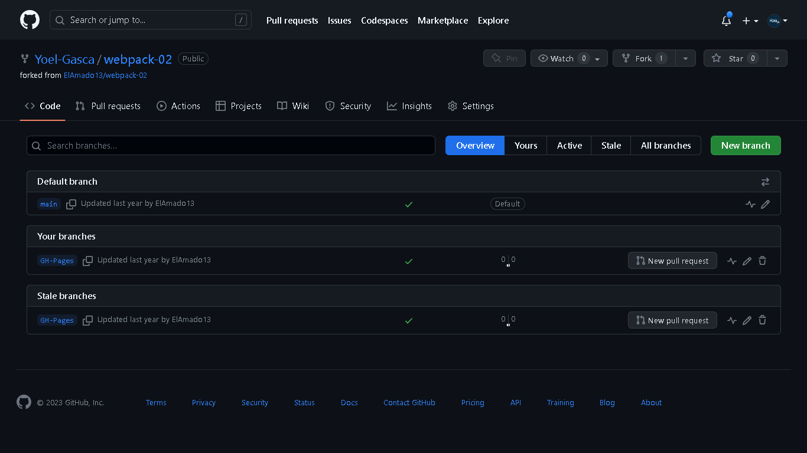

# 🚀 Reto 2: Introducción a Git & GitHub
Reúnete con un amigo para trabajar en el código del otro. Crea un proyecto en colaboración, haz fork del código, crea ramas y hagan merge a los cambios.

## Repocitorio
Se creo este repocitorio para este reto al cual se le hara un bifurqueo, asi como tambien se creara un branch para desplegar el proyecto con GH-pages.

## Fork
Se crea el fork del repocitorio original.

## Branches
Se creo un branch el cual se usara para el despliegue del proyecto con GitHub pages

 

Esta es la evidencia que corresponde al Reto 2 de la leccion <a href="https://github.com/microsoft/Web-Dev-For-Beginners/blob/main/1-getting-started-lessons/2-github-basics/translations/README.es.md">Introducción a Git & GitHub</a> del curso <a href="https://github.com/microsoft/Web-Dev-For-Beginners">WEB DEVELOPMENT FOR BEGINNERS</a> de Microsoft.

