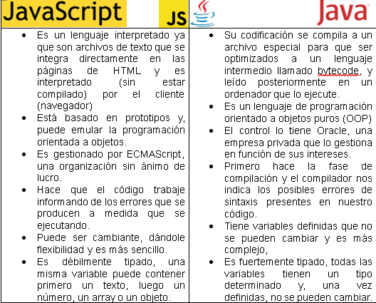
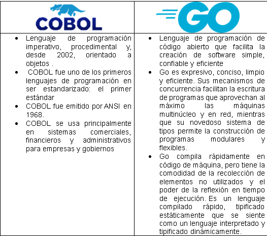

# 🚀 Reto 1
Compara algunos lenguajes de programación. ¿Cuáles son algunos de los rasgos únicos de JavaScript frente a Java? ¿Qué hay de COBOL vs. Go?

#### Evidencia 1 Reto 1
##### Comparación entre JavaScript y Java

#### Evidencia 2 Reto 1
##### Comparación entre COBOL vs GO

Esta es la evidencia que corresponde al Reto 1 de la leccion <a href="https://github.com/microsoft/Web-Dev-For-Beginners/blob/main/1-getting-started-lessons/1-intro-to-programming-languages/translations/README.es.md">Introducción a lenguajes de programación y herramientas del oficio</a> del curso <a href="https://github.com/microsoft/Web-Dev-For-Beginners">WEB DEVELOPMENT FOR BEGINNERS</a> de Microsoft.