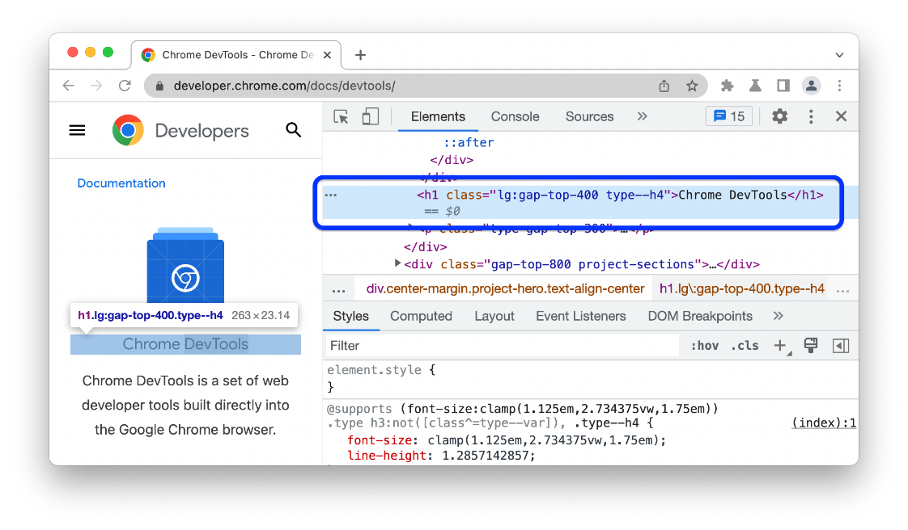
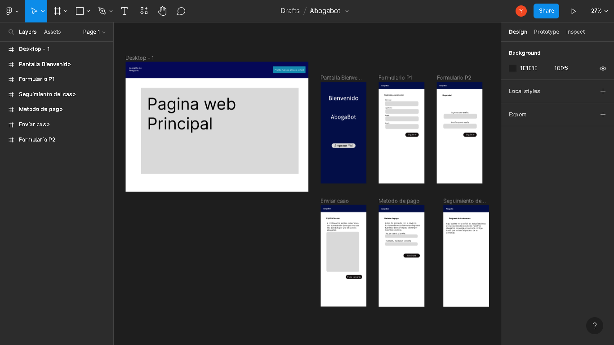
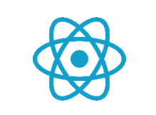
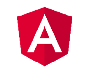
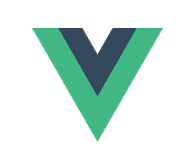

# Tarea
Seleccionar 3 herramientas y explicar por qué un Desarrollador Web las debería usar, buscar una herramienta que pertenezca a esta categoría y compartir la documentación. No utilizar los ejemplos de herramientas brindados en la documentación de MDN.

## 1.- DevTools
DevTools es un conjunto de herramientas de desarrollo web que aparece junto a una página web representada en el explorador. DevTools proporciona una manera eficaz de inspeccionar y depurar páginas web y aplicaciones web. Incluso puede editar archivos de origen y crear proyectos de sitio web, todo dentro del entorno de DevTools.
Con DevTools, puede hacer lo siguiente:
- Inspeccione, ajuste y cambie los estilos de los elementos de la página web mediante herramientas dinámicas con una interfaz visual. Inspeccione dónde almacenó el contenido del explorador para construir la página web, incluidos .htmllos formatos de archivo , .css, .jsy .png .
- Emula cómo se comporta el sitio web en diferentes dispositivos y simula un entorno móvil, completo con diferentes condiciones de red. Inspeccione el tráfico de red y vea la ubicación de los problemas.
- Depuración de JavaScript mediante la depuración de puntos de interrupción y con la consola en directo. Busque problemas de memoria y problemas de representación con las aplicaciones web.
- Busque problemas de accesibilidad, rendimiento, compatibilidad y seguridad en sus productos y use DevTools para corregir los problemas de accesibilidad que se encuentran.
- Use un entorno de desarrollo para sincronizar los cambios en DevTools con el sistema de archivos y desde la web.

## 2.- Figma
Figma es el sitio donde los equipos se reúnen para diseñar. Figma es útil para que los equipos creen, prueben y trabajen mejor con sus diseños de principio a fin. Los equipos usan FigJam, una pizarra en línea, para trabajar con sus lluvias de ideas, diagramar y divertirse juntos.
Lo habitual en prácticamente cualquier software es que se tenga que descargar un archivo comprimido de varios MB, esperar a que descargue, instale e inicie el programa.
Con Figma, como está basado en el navegador, lo único que se tiene que hacer es registrarte y ya se puede empezar a diseñar interfaces graficas UX/UI para nuestras aplicaciones o sitios web. Así, sin más.
También se puede descargarla. Y lo mejor es que, además, también es compatible con Windows.
En figma se pueden crear diseños como el siguiente:

## 3.- Frameworks y librerias para el desarrollo web
Los Frameworks y librerías son una estructura previa que se puede aprovechar para desarrollar un proyecto.
El Framework es una especie de plantilla, un esquema conceptual, que simplifica la elaboración de una tarea, ya que solo es necesario complementarlo de acuerdo a lo que se quiere realizar.
Dependiendo del tipo de proyecto, esta tarea puede durar mucho tiempo si se crea de la nada. Es necesario elaborar parte por parte, haciendo pruebas y aciertos hasta conseguir el objetivo.
A continuación, se muestran los frameworks y librerías más usadas actualmente 
- React 
Es una librería del lenguaje de programación JavaScript de código abierto Fue desarrollada por Facebook en el 2013 con la finalidad de facilitar la creación de componentes reutilizables e interactivos para las interfaces de usuario. Para comprender cómo funciona React es clave que nos situemos en un contexto, pues cuando se aprende desarrollo web se obtiene conocimiento de tres conceptos básicos, HTML que es la semántica, estructura e informacion de una pagina web, CSS es la apariencia para los estilos de la pagina y JavaScript que es el cerebro el cual determina que hacer dependiendo su función.
- Angular 
Es un framework de JavaScript potente, muy adecuado para el desarrollo de aplicaciones FrontEnd modernas, de complejidad media o elevada. ofrece una base para el desarrollo de aplicaciones robustas, escalables y optimizadas, que promueve además las mejores prácticas y un estilo de codificación homogéneo y de gran modularidad. El desarrollo en Angular se hace por medio de TypeScript (aunque también se podría desarrollar con JavaScript, todas las guías y recomendaciones se basan en usar TypeScript), un superset del lenguaje JavaScript que ofrece muchas herramientas adicionales al lenguaje, como el tipado estático o los decoradores.
- Vue.js
Es un framework progresivo JavaScript para crear interfaces de usuario, o en otras palabras, se trata de una «capa» añadida a JavaScript formada por herramientas, convenciones de trabajo y un lenguaje particular que nos permite crear aplicaciones de forma rápida, agradable, sencilla y muy práctica.

  

#### Esta es la evidencia que corresponde a la <a href="https://github.com/microsoft/Web-Dev-For-Beginners/blob/main/1-getting-started-lessons/1-intro-to-programming-languages/translations/assignment.es.md">tarea</a> de la lección <a href="https://github.com/microsoft/Web-Dev-For-Beginners/blob/main/1-getting-started-lessons/1-intro-to-programming-languages/translations/README.es.md">Introducción a lenguajes de programación y herramientas del oficio</a> del curso <a href="https://github.com/microsoft/Web-Dev-For-Beginners">WEB DEVELOPMENT FOR BEGINNERS</a> de Microsoft.