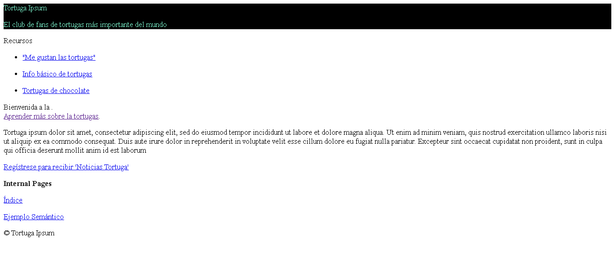
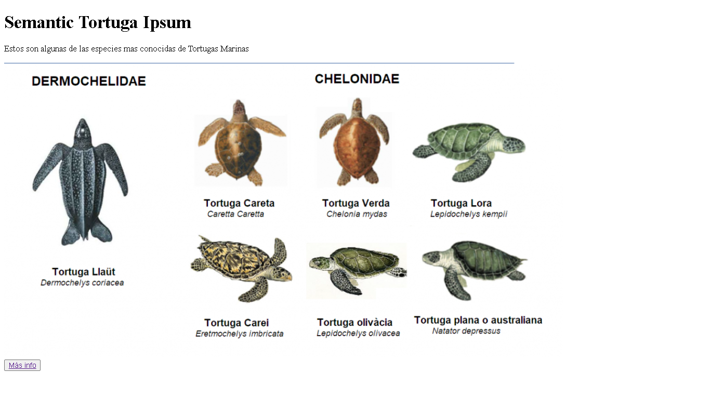

# 🚀 Reto 3: Creación de páginas web accesibles
Una web accesible para algunos no es una verdadera "red mundial". La mejor manera de garantizar que los sitios que creas sean accesibles, es incorporar las mejores prácticas de accesibilidad desde el principio. Si bien hay pasos adicionales involucrados, incorporar estas habilidades en tu flujo de trabajo ahora significará que todas las páginas que creas sean accesibles.<br/>

🚀 Desafío: toma este HTML y vuelve a escribirlo para que sea lo más accesible posible, dados los temas que aprendiste.

```
<!DOCTYPE html>
<html>
  <head>
    <title>
      Ejemplo
    </title>
    <link href='../assets/style.css' rel='stylesheet' type='text/css'>
  </head>
  <body>
    <div class="site-header">
      <p class="site-title">Tortuga Ipsum</p>
      <p class="site-subtitle">El club de fans de tortugas más importante del mundo</p>
    </div>
    <div class="main-nav">
      <p class="nav-header">Recursos</p>
      <div class="nav-list">
        <p class="nav-item nav-item-bull"><a href="https://www.youtube.com/watch?v=CMNry4PE93Y">"Me gustan las tortugas"</a></p>
        <p class="nav-item nav-item-bull"><a href="https://en.wikipedia.org/wiki/Tortuga">Info básico de tortugas</a></p>
        <p class="nav-item nav-item-bull"><a href="https://en.wikipedia.org/wiki/Tortugas_(chocolate)">Tortugas de chocolate</a></p>
      </div>
    </div>
    <div class="main-content">
      <div>
        <p class="page-title">Bienvenida a la Tortuga Ipsum. 
            <a href="">Haz clic aquí</a> para aprender más.
        </p>
        <p class="article-text">
          Tortuga ipsum dolor sit amet, consectetur adipiscing elit, sed do eiusmod tempor incididunt ut labore et dolore magna aliqua. Ut enim ad minim veniam, quis nostrud exercitation ullamco laboris nisi ut aliquip ex ea commodo consequat. Duis aute irure dolor in reprehenderit in voluptate velit esse cillum dolore eu fugiat nulla pariatur. Excepteur sint occaecat cupidatat non proident, sunt in culpa qui officia deserunt mollit anim id est laborum
        </p>
      </div>
    </div>
    <div class="footer">
      <div class="footer-section">
        <span class="button">Regístrese para recibir 'Noticias Tortuga'</span>
      </div><div class="footer-section">
        <p class="nav-header footer-title">
          Internal Pages
        </p>
        <div class="nav-list">
          <p class="nav-item nav-item-bull"><a href="../">Índice</a></p>
          <p class="nav-item nav-item-bull"><a href="../semantic">Ejemplo Semántico</a></p>
        </div>
      </div>
      <p class="footer-copyright">&copy; Instrument 2016</span>
    </div>
  </body>
</html>

```

## Revisión y auto-estudio
Muchos gobiernos tienen leyes sobre los requisitos de accesibilidad. Lee sobre las leyes de accesibilidad de tu país de origen. ¿Qué está cubierto y qué no? Un ejemplo es este sitio web de gobierno.

Para hacer este sitio más accesible solo se hicieron algunas correcciones al código que fue proporcionado.
```
<!DOCTYPE html>
<html lang="en">
  <head>
    <meta charset="UTF-8">
    <meta 
        name="description"
        content="Tortugas, Animales, Reptiles, Marinos, El club de fans de tortugas más importante del mundo">
    <meta http-equiv="X-UA-Compatible" content="IE=edge">
    <meta name="viewport" content="width=device-width, initial-scale=1.0">
    <title>
      Tortuga Ipsum
    </title>
    <link href='./assets/styless.css' rel='stylesheet' type='text/css'>
  </head>
  <body>
    <div class="site-header">
      <p class="site-title">Tortuga Ipsum</p>
      <p class="site-subtitle">El club de fans de tortugas más importante del mundo</p>
    </div>
    <div class="main-nav">
      <p class="nav-header">Recursos</p>
      <nav class="nav-list">
        <ul>
          <li>
            <p class="nav-item nav-item-bull"><a href="https://www.youtube.com/watch?v=CMNry4PE93Y">"Me gustan las tortugas"</a></p>  
          </li>
          <li>
            <p class="nav-item nav-item-bull"><a href="https://en.wikipedia.org/wiki/Tortuga">Info básico de tortugas</a></p>
          </li>
          <li>
            <p class="nav-item nav-item-bull"><a href="https://en.wikipedia.org/wiki/Tortugas_(chocolate)">Tortugas de chocolate</a></p>
          </li>
        </ul>
      </nav>
    </div>
    <div class="main-content">
      <div>
        <p class="page-title">Bienvenida a la .<br>
            <a href="https://es.wikipedia.org/wiki/Testudines">Aprender más sobre la tortugas</a>.
        </p>
        <p class="article-text">
          Tortuga ipsum dolor sit amet, consectetur adipiscing elit, sed do eiusmod tempor incididunt ut labore et dolore magna aliqua. Ut enim ad minim veniam, quis nostrud exercitation ullamco laboris nisi ut aliquip ex ea commodo consequat. Duis aute irure dolor in reprehenderit in voluptate velit esse cillum dolore eu fugiat nulla pariatur. Excepteur sint occaecat cupidatat non proident, sunt in culpa qui officia deserunt mollit anim id est laborum
        </p>
      </div>
    </div>
    <div class="footer">
      <div class="footer-section">
        <a href="./login.php" class="button">Regístrese para recibir 'Noticias Tortuga'</a>
      </div><div class="footer-section">
        <p class="nav-header footer-title"><strong>
          Internal Pages</strong>
        </p>
        <div class="nav-list">
          <p class="nav-item nav-item-bull"><a href="./.">Índice</a></p>
          <p class="nav-item nav-item-bull"><a href="./assets/semantic.html">Ejemplo Semántico</a></p>
        </div>
      </div>
      <p class="footer-copyright">&copy; Tortuga Ipsum</span>
    </div>
  </body>
</html>

```
Se hicieron algunos cambios que mejoran la accesibilidad<br/>



Los cambios que se realizaron fueron algunos mínimos para mejorar la accesibilidad los cuales se pueden mejorar su aspecto visual con CSS para que sean aún más accesibles y tengan una mejor presentación. De momento se en el menu se le dio un aspecto de tabla la cual podría emplearse como una barra de navegación.

También los links que ya estaban se les arreglo las palabras de referencia para que fueran más fácil de leer.

Por ulltimo se le agregaron links a las etiquetas que no tenían una redirección y también se creó un archivo más el cual muestra el ejemplo semántico de las tortugas marinas y un boton que redirecciona a más informacion sobre estos ejemplares del mundo animal.

<br/>

Esta es la evidencia que corresponde al Reto 3 de la lección <a href="https://github.com/microsoft/Web-Dev-For-Beginners/blob/main/1-getting-started-lessons/3-accessibility/translations/README.es.md">Creación de páginas web accesibles</a> del curso <a href="https://github.com/microsoft/Web-Dev-For-Beginners">WEB DEVELOPMENT FOR BEGINNERS</a> de Microsoft.
