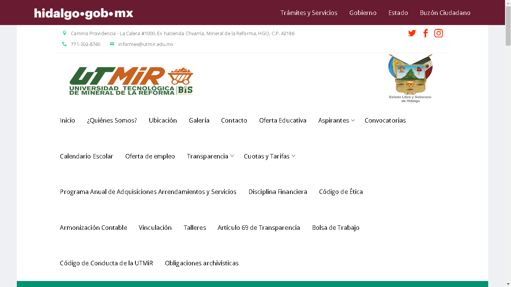
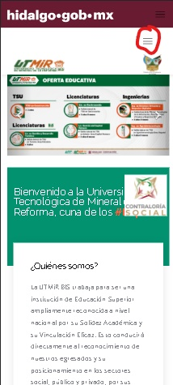
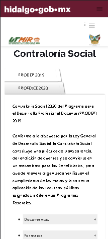
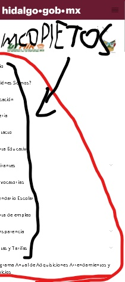
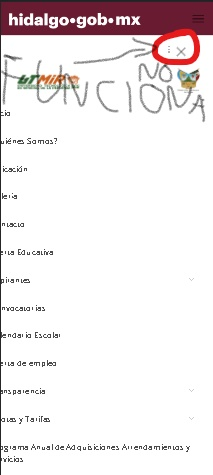
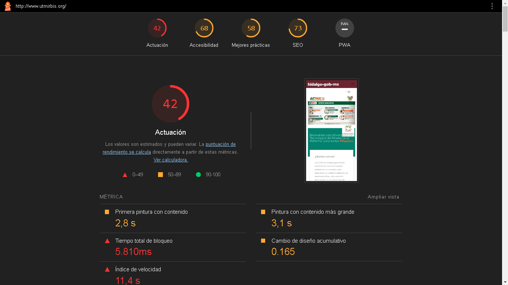

# Tarea: Creación de páginas web accesibles
Identifica un sitio web que creas que NO es accesible y crea un plan de acción para mejorar su accesibilidad. Tu primera tarea será identificar este sitio, detallar las formas en que crees que es inaccesible sin usar herramientas analíticas y luego someterlo a un análisis Lighthouse. Toma los resultados de este análisis y describe un plan detallado con un mínimo de diez puntos que muestre cómo se podría mejorar el sitio.

## Rúbrica

| Criterios       | Ejemplar                                                                                                                                                      | Adecuado                    | Necesita mejorar           |
| -------------- | -------------------------------------------------------------------------------------------------------------------------------------------------------------- | --------------------------- | --------------------------- |
| informe del estudiante | incluye párrafos sobre cómo el sitio es inadecuado, el informe Lighthouse capturado como un pdf, una lista de diez puntos para mejorar, con detalles sobre cómo mejorarlo | falta el 20% de lo requerido | falta el 50% de lo requerido
 |

 El siguiente <a href="http://www.utmirbis.org/">sitio</a> pertenece a una universidad pública en Mexico. En el sitio lo primero que se puede visualizar lo siguiente:

 

 Esta interfaz está ligada a una plantilla que proporciona la dependencia o jurisdicción gubernamental a la que pertenece por lo que limita las opciones para un mejor diseño visual de la interfaz.

Esto también repercute en un poco en el diseño responsive del sitio ya que algunos elementos no se ven completos como la barra de navegación y algunas imágenes.
- <strong>Barra de navegación</strong> 
En esta sección al momento de trasladarnos a un teléfono móvil se puede ver que no es muy accesible ya que al pulsar el botón para abrir este menú lo que hace es mandar a otra parte del sitio.

  

- <strong>Mala vision de elementos y mal funcionamiento de botones</strong> 
Al volver al pulsar en el botón desde la segunda interfaz ya muestra el menú, pero se ve imcompleto y algunos de sus elementos no se aprecian. Además de que si se quiere cerrar este menú el botón que se supone hace esta función no la realiza.

  

- <strong>Informe Lighthouse</strong> 
En el informe de Lighthouse se muestra lo siguiente:
 

<a href="./Doc/InformeUtmir.pdf">Documento pdf</a> 

Debido a como está desarrollado el sitio la mejor opción para un plan de mejora seria atender lo que apunta el informe de lighthouse como ajustar el tamaño de algunas imágenes, agregar los atributos alt para agregar referencias, nombres mas accesibles para los botones, atender los mensajes de advertencia que marca el informe, arreglar lo antes mencionado sobre la barra de navegacion, entre otros demás apuntes que puede haber para mejorar las puntuaciones del informe de Lighthouse.

#### Esta es la evidencia que corresponde a la <a href="https://github.com/microsoft/Web-Dev-For-Beginners/blob/main/1-getting-started-lessons/3-accessibility/translations/assignment.es.md">tarea</a> de la lección <a href="https://github.com/microsoft/Web-Dev-For-Beginners/blob/main/1-getting-started-lessons/3-accessibility/translations/README.es.md">Creación de páginas web accesibles</a> del curso <a href="https://github.com/microsoft/Web-Dev-For-Beginners">WEB DEVELOPMENT FOR BEGINNERS</a> de Microsoft.